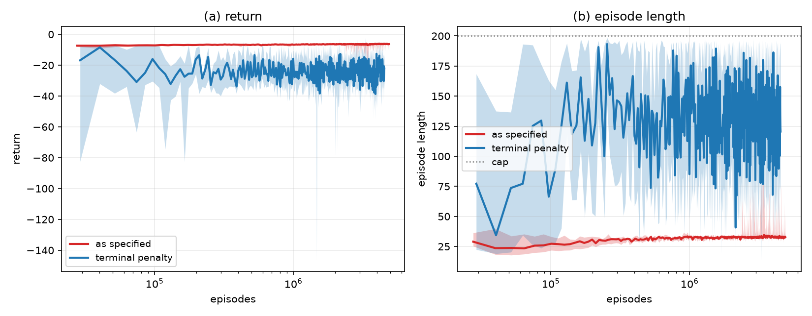
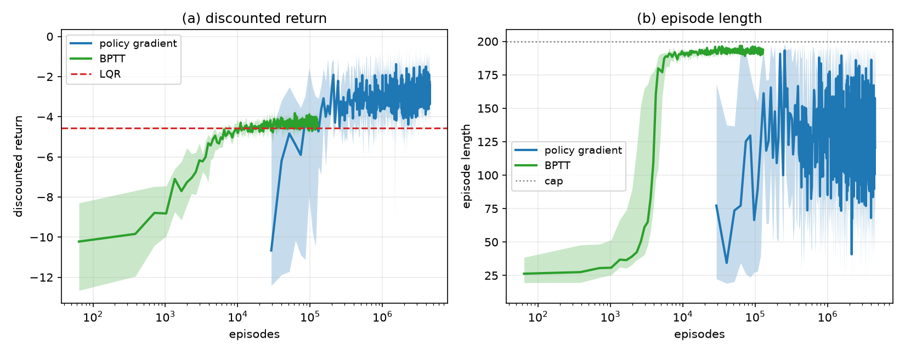
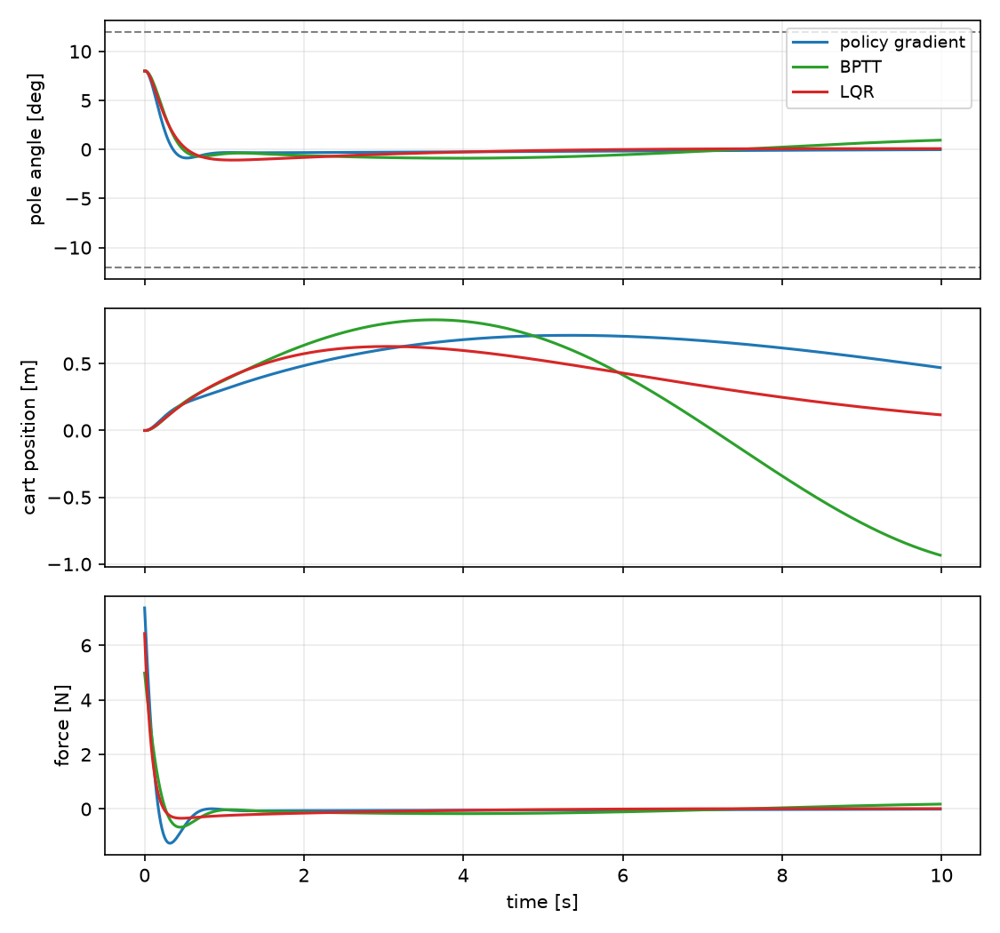
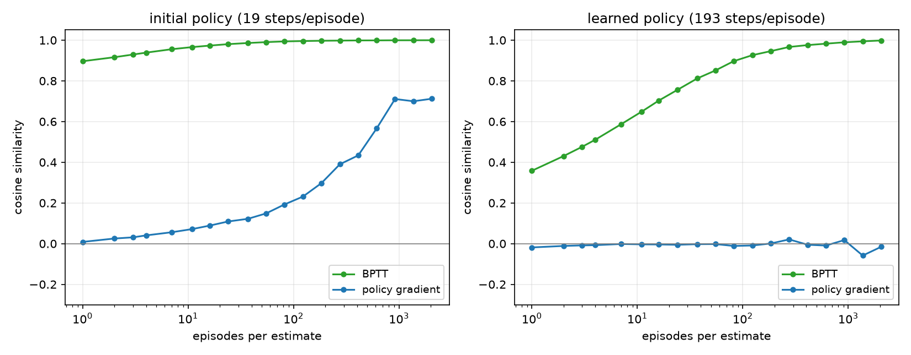
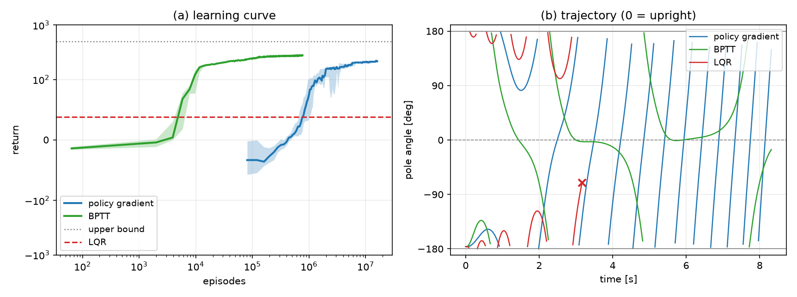

# 論理生命学 課題 石井先生担当分

学籍番号 6930377841 南川健志郎
2026年7月30日

# レポート課題2: カートポールの安定化制御

カートポールの安定化は, 不安定平衡点まわりの制御問題として制御理論・強化学習の双方で標準的なベンチマークである. 本レポートでは課題2.2節に示された方策勾配法を実装し, カートポールの安定化制御を学習する.

さらに発展として, 同じ方策クラス・同じ目的関数の上で二つの比較対象を実装した. 一つは運動方程式を微分可能なシミュレータとみなし, 模擬エピソードを時間方向に逆伝播 (BPTT) して解析的な方策勾配を得るモデルベースの手法であり, もう一つは線形化と二次形式評価関数から制御則を直接解くLQRである. 三者は「環境のモデルをどの段階でどれだけ利用するか」が異なるだけで最適化の対象は共通しており, サンプル効率・勾配推定の分散・モデル誤差への耐性という三つの軸で相補的な関係にあることを示す. 最後に, 真下から振り上げるswing-up課題を発展課題として定義し, 三手法のいずれもこれを解ききれないことと, その原因を報告する.

また実装の過程で, 課題に指定された報酬 $r = -s'Qs - aRa$ をそのまま用いると目的関数が縮退し, 「ポールを倒して早期に終端する」方策が大域最適解になることが分かった. 学習によって安定化制御が得られるのは, 勾配上昇が最適解ではない局所解に留まるためである. この点を交差エントロピー法による直接探索で確認した上で, 終端ペナルティを加えた設定との比較を行う.

## 1 問題設定

### 1.1 カートポール

水平方向に移動するカートの上に, 回転関節を介してポールが取り付けられている. カートに水平方向の力を加えることで, ポールを倒さないように直立状態を維持することが目的である. 各時刻 $t$ における変数を課題2.1節に従って以下に定義する.

**観測 $s_t$**
　4次元の連続状態 $s = (x, \dot{x}, y, \dot{y})$. ここで $x$ はカート位置 [m], $\dot{x}$ はカート速度 [m/s], $y$ は鉛直方向を $0$ としたポール角度 [rad], $\dot{y}$ は角速度 [rad/s] である.

**行動 $a_t$**
　カートに加える力 $a$ [N] であり, 1次元の連続値をとる. $|a| > 20$ [N] の場合, 環境は超過分を無視して $\pm 20$ [N] を実行する.

**報酬 $r_t$**
　二次形式 $r = -s'Qs - aRa$, ただし $Q = \mathrm{diag}(1.25, 1, 12, 0.25)$, $R = 0.01$ である. $|x| > 2.4$ [m], $|\dot{x}| > 2$ [m/s], $|y| > 12\pi/180$ [rad], $|\dot{y}| > 1.5$ [rad/s] のいずれかを満たした時点でエピソードを終端する.

**初期状態**
　$s_0 \sim \mathcal{N}(\boldsymbol{0}, \Sigma)$, $\Sigma = \mathrm{diag}(0.01, 0.01, 0.01, 0.01)$.

運動方程式は, カート質量 $M = 1.0$ [kg], ポール質量 $m = 0.1$ [kg], ポールの長さ $2l = 1$ [m], 重力加速度 $g = 9.8$ [m/s$^2$], カートの摩擦係数 $\mu_c = 0.0005$, ポールの摩擦係数 $\mu_p = 0.000002$ を用いて次式で与えられる:

$$\ddot{y} = \frac{g\sin y + \cos y\left( \dfrac{\mu_c \mathrm{sgn}(\dot{x}) - a - ml\dot{y}^2 \sin y}{M+m} \right) - \dfrac{\mu_p \dot{y}}{ml}}{l\left( \dfrac{4}{3} - \dfrac{m\cos^2 y}{M+m} \right)}, \qquad \ddot{x} = \frac{a + ml(\dot{y}^2\sin y - \ddot{y}\cos y) - \mu_c \mathrm{sgn}(\dot{x})}{M+m} \tag{1}$$

時定数を $\tau = 1/60$ [s] とし, $x := x + \tau\dot{x}$, $\dot{x} := \dot{x} + \tau\ddot{x}$, $y := y + \tau\dot{y}$, $\dot{y} := \dot{y} + \tau\ddot{y}$ により状態を遷移させる (陽的Euler法).

学習時の1エピソードの上限は200ステップ (3.33秒) とした. 割引率は課題指定の $\gamma = 0.95$ であり, $\tau = 1/60$ のもとでは実効的な時間視野が $1/(1-\gamma) = 20$ ステップ, すなわち約0.33秒しかない. この短さは4.1節で述べる報酬設計の問題に直接関係する.

学習後の方策の評価は, 初期状態分布から引いた256個の初期状態それぞれについて上限600ステップ (10秒) のシミュレーションを行い, 行動の平均 $\mu(s)$ を用いる決定論的方策で測定した. 初期状態は $\mathcal{N}(0, 0.01)$ から引くため約3.6%は最初から $|y| > 12°$ を満たしており, どの制御則でも維持できない. これらは評価から除外している. 以下で「成功率」と呼ぶのは, 10秒間を通して一度も終端しなかった初期状態の割合である.

## 2 アルゴリズム

### 2.1 方策勾配法

課題2.2節に示された方策勾配法を実装した. 方策は行動についてのガウス分布

$$\pi(a|s; \boldsymbol{\theta}, \eta) = \mathcal{N}(\mu, \sigma^2), \qquad \mu = \boldsymbol{\theta}'C\boldsymbol{s}, \qquad \sigma = 0.1 + \frac{1}{1 + \exp(\eta)} \tag{2}$$

で与えられる. $C = \mathrm{diag}(1/2.4, 1/2, 180/(12\pi), 1/1.5)$ は状態の各次元を $[-1, 1]$ へ正規化する対角行列である. パラメータは4次元ベクトル $\boldsymbol{\theta}$ とスカラー $\eta$ の計5個であり, $\theta_i \sim U[-5, 5]$, $\eta \sim U[-1, 1]$ で初期化する.

各エピソードでは $\boldsymbol{z} = 0$, $\boldsymbol{\delta} = 0$, $t = 0$ から始め, 各ステップで

$$\boldsymbol{z} := \boldsymbol{z} + \left[ \nabla_{\boldsymbol{\theta}} \ln \pi, \ \nabla_{\eta} \ln \pi \right]', \qquad \boldsymbol{\delta} := \boldsymbol{\delta} + \boldsymbol{z} r \gamma^t, \qquad t := t+1 \tag{3}$$

と勾配を逐次蓄積する. $\boldsymbol{\delta}$ は1エピソードから得られる方策勾配の推定値であり, 尤度比 (score function) 型の推定量である.

エピソード終了ごとに, 推定値の移動平均を

$$\boldsymbol{\Delta}_{past} := \boldsymbol{\Delta}, \qquad \boldsymbol{\Delta} := \frac{n-1}{n}\boldsymbol{\Delta} + \frac{1}{n}\boldsymbol{\delta}, \qquad n := n+1 \tag{4}$$

により更新し, 前回までの推定値との角度 $\angle(\boldsymbol{\Delta}_{past}, \boldsymbol{\Delta})$ が基準 $\epsilon = 3/1000$ [rad] より小さければ推定が収束したとみなして

$$[\boldsymbol{\theta}', \eta]' := [\boldsymbol{\theta}', \eta]' + \alpha\boldsymbol{\Delta}, \qquad n := 1 \tag{5}$$

と方策を改善する. 移動平均の変化量は $1/n$ で減衰するため, この基準は「推定値が十分な本数のエピソードで平均されるまで方策を更新しない」という分散抑制として働く.

課題指定の更新則に対して, 本実装では1点だけ変更を加えている. **式(5)の更新に勾配ノルムの上限 (クリッピング) を設けた**. 1エピソードから得られる $\boldsymbol{\delta}$ の分布は裾が非常に重く, 稀に外れ値が $\boldsymbol{\Delta}$ を支配する. 式(5)は $\boldsymbol{\Delta}$ を正規化せずそのまま $\alpha$ 倍して加算するため, このとき通常の数百倍の更新がそのまま適用されて学習が発散する. 学習中の更新量を記録すると, 通常の更新は $\alpha\|\boldsymbol{\Delta}\| \approx 0.05$ である一方, 発散した試行では $25$–$30$ (パラメータのノルムの約5倍) の更新が入っていた. しかもそれは移動平均に取り込んだ推定値の本数 $n$ が $10$–$35$ と小さい段階に集中しており, $n$ が小さく $\boldsymbol{\Delta}$ が外れ値に支配されている時期に角度基準が偶然満たされることが引き金になっている. そこで $\|\boldsymbol{\Delta}\|$ の上限を $3$ (実測した $\|\boldsymbol{\Delta}\|$ の99パーセンタイル相当) とした. 通常の更新は $\|\boldsymbol{\Delta}\|$ の中央値が $1$ 程度なのでこの上限には触れず, 外れ値のみが抑えられる. これにより安定化課題では発散が完全に消え, swing-up課題でも導入前の16試行中10試行から0〜2試行へ減った (完全には消えない. 3.3節で述べる実行ごとの変動により, 同一設定でも発散する試行数は変わる). 学習係数は $\alpha = 0.5$ とした.

### 2.2 BPTTによる解析的方策勾配

2.1節の方策勾配法は環境のダイナミクスを一切用いない. 一方で本課題では運動方程式(1)が既知であり, しかもそれは初等関数からなる微分可能な写像である. そこで比較対象として, 内部モデルを微分して方策勾配を直接計算する手法を実装した.

行動を $a_t = \mu(s_t) + \sigma \varepsilon_t$, $\varepsilon_t \sim \mathcal{N}(0,1)$ と再パラメータ化すると, 乱数列 $\{\varepsilon_t\}$ を固定した1本の軌道は方策パラメータの決定論的で微分可能な関数になる. したがって割引収益

$$J = \sum_{t} \gamma^t r(s_t, a_t), \qquad s_{t+1} = f(s_t, a_t) \tag{6}$$

を軌道全体にわたって逆伝播することで $\nabla J$ が解析的に求まる. これは再帰的な計算グラフを時間方向に展開して微分することからBPTT (backpropagation through time) と呼ばれ, 推定量としては pathwise 型 (再パラメータ化勾配) に分類される. 2.1節の尤度比型の推定量とは, 同じ $\nabla J$ を推定しながら分散の性質が大きく異なる (4.4節).

この手法は実環境との相互作用を一切必要とせず, モデル上の模擬エピソードのみで学習する. 一方で次の三つの制約をもつ.

- (i) モデルが正確であることに完全に依存する (4.5節).
- (ii) 終端条件による不連続を微分できない. 終端判定は状態の指示関数であり勾配が恒等的に0なので, 「終端を避ける」ことを勾配から学習できない. 本実装では終端後の状態を凍結する近似を用いている.
- (iii) 倒立平衡点が不安定 ($\lambda \approx \sqrt{g/\{l(4/3 - m/(M+m))\}} \approx 3.9$ [1/s]) であるため, 長いホライズンでは勾配が指数的に増大しうる (5.4節).

安定化課題ではバッチ64本の模擬エピソード (ホライズン200ステップ) から勾配の平均を求め, 学習係数 $0.1$ で勾配上昇する操作を2000回繰り返した. swing-up課題ではホライズンを400ステップ, 更新回数を12000回とし, さらに勾配ノルムを1に制限した (5.4節).

### 2.3 LQR

さらに比較対象として, 学習を用いない古典的手法である線形二次レギュレータ (LQR) を実装した. 式(1)を直立平衡点まわりで線形化し (摩擦項は無視する), 時定数 $\tau$ で離散化した状態方程式 $A = I + \tau A_c$, $B = \tau B_c$ を得る. 課題の即時報酬は $-s'Qs - aRa$ であり, これは二次形式評価関数そのものであるから, 本課題の目的関数は割引つきLQ問題

$$\min \sum_t \gamma^t (s_t'Qs_t + a_t R a_t) \tag{7}$$

に一致する. 割引つきの問題は $(A, B)$ を $\sqrt{\gamma}$ 倍した標準的なLQ問題に帰着するので, 離散時間Riccati方程式を解いて状態フィードバック $a = k's$ が定まる. 得られたゲインは

$$k = (0.385,\ 1.833,\ 46.081,\ 11.203) \tag{8}$$

であった. ここで重要なのは, 式(2)のガウス方策の平均 $\mu = \boldsymbol{\theta}'C\boldsymbol{s}$ もまた線形状態フィードバックだという点である. すなわち強化学習が探索している方策クラスとLQRの解は同一の空間に属し, 学習結果を $\boldsymbol{\theta} = k/\mathrm{diag}(C)$ としてゲインの水準で直接比較できる. 式(8)に対応する方策パラメータは $\boldsymbol{\theta} = (0.924, 3.666, 9.651, 16.805)$ であり, 第3・第4成分は初期化の範囲 $U[-5,5]$ の外側にある. 初期方策は原理的に最適解の近傍を取り得ず, 学習はパラメータ空間をある程度の距離だけ移動する必要がある.

ただしLQRが厳密に最適なのは終端のない無限時間のLQ問題に対してである. 実際の課題には終端条件と有限のエピソード長があるため, LQRは本課題の最適解とは限らない.

## 3 実装

プログラムは `env.py`, `agent.py`, `main.py` の3つからなる. 実装にはJAXを用い, 環境・エージェントの状態をすべて関数の引数と返り値として陽に受け渡す純粋関数として記述した上で, 学習ループ全体を単一の `jax.lax.scan` にまとめて `jax.jit` でコンパイルしている. さらに `jax.vmap` により16個のseedを同時に学習させ, 結果が特定のseedに依存しないことを確認した. プログラムの詳細な説明は避け, 重要な部分のみ述べる.

### 3.1 env.py

式(1)の運動方程式と陽的Euler法による離散化を実装した純粋関数 `dynamics` を中心に構成される. `step` は連続行動を $\pm 20$ [N] に制限し, 報酬と終端判定を返す.

```python
def step(params: CartPoleParams, state: jnp.ndarray, action) -> tuple:
    """連続行動を受けて1ステップ進める. 報酬は r = -s'Qs - aRa (swing-upでは (1+cos y)/2)."""
    force = jnp.clip(action, -params.force_limit, params.force_limit)
    if params.upright_reward:
        reward = (1.0 + jnp.cos(state[2])) / 2.0 - params.position_cost * (state[0] / params.state_limit[0]) ** 2
    else:
        reward = -(jnp.dot(jnp.array(params.cost_state), state**2) + params.cost_action * force**2)
    next_state = dynamics(params, state, force)
    if params.wrap_angle:
        next_state = next_state.at[2].set(jnp.mod(next_state[2] + jnp.pi, 2.0 * jnp.pi) - jnp.pi)
    outside = jnp.abs(next_state) > jnp.array(params.state_limit)
    done = jnp.any(outside & jnp.array(params.terminate_on))
    return next_state, reward + jnp.where(done, params.fail_penalty, 0.0), done
```

報酬の種類・終端する状態次元・角度の折り返し・終端時の追加報酬をすべて `CartPoleParams` の設定として持たせることで, 安定化課題 (4章) とswing-up課題 (5章) を同一の `step` 関数で扱っている. 既定値は課題2.1節の設定に一致し, 終端時の追加報酬 `fail_penalty` は $0$ である.

### 3.2 agent.py

方策の対数尤度は式(2)をそのまま実装した. その勾配 (score) は `jax.grad` でも得られるが, 全レーンをまとめて評価するために解析形も実装し, 両者が一致することを確認した上で解析形を用いている.

```python
def scores(config: AgentConfig, spec: PolicySpec, policy: jnp.ndarray,
           states: jnp.ndarray, actions: jnp.ndarray):
    """全レーンのscore (解析形. jax.gradと一致することを確認している)."""
    std = action_std(config, policy)
    phi = jax.vmap(feature_vector, in_axes=(None, 0))(spec, states)
    residual = (actions - phi @ policy[:phi.shape[1]]) / std**2
    grad_theta = residual[:, None] * phi
    sigmoid = jax.nn.sigmoid(-policy[-1])
    grad_eta = -sigmoid * (1.0 - sigmoid) * (residual**2 * std**2 - 1.0) / std
    return jnp.concatenate([grad_theta, grad_eta[:, None]], axis=1)
```

ここで `feature_vector` は方策への入力 $\phi(s)$ を返す関数であり, 課題指定の設定では $\phi(s) = C\boldsymbol{s}$ そのものである (5.2節で拡張する). 方策の平均は常に $\mu = \boldsymbol{\theta}'\phi(s)$ という特徴の線形結合であり, 変わるのは特徴の作り方だけなので, 更新則 (式(3)–(5)) もscoreの解析形も課題設定とswing-up課題で完全に共通である.

BPTTによる解析的方策勾配は, 再パラメータ化した軌道の割引収益を `jax.lax.scan` で計算し, その関数を `jax.value_and_grad` で微分するだけで得られる. 終端後は状態を凍結しており, これは終端した軌道の発散が勾配へ流れ込むことを防ぐためである.

```python
def imagined_return(model, config, spec, policy, x0, noise):
    """再パラメータ化した模擬エピソードの割引収益 (エピソード長を補助出力とする)"""
    def body(carry, eps):
        state, alive, discount = carry
        action = mean_action(spec, policy, state) + action_std(config, policy) * eps
        next_state, reward, done = env.step(model, state, action)
        next_state = jnp.where(alive, next_state, state)  # 終端後は状態を凍結する
        return ((next_state, alive & ~done, discount * config.gamma),
                (jnp.where(alive, discount * reward, 0.0), alive))
    _, (values, alive) = jax.lax.scan(body, (x0, jnp.bool_(True), 1.0), noise)
    return jnp.sum(values), jnp.sum(alive)

analytic_gradient = jax.value_and_grad(imagined_return, argnums=3, has_aux=True)
```

実装では学習曲線を描くために補助出力をもう一つ返しているが, 勾配の計算に関わるのは上式の第1返り値のみである.

### 3.3 並列化と逐次実装との対応

方策勾配法の1ステップあたりの計算はスカラー数個の演算にすぎないため, 逐次に実行すると計算資源をほとんど活用できない. そこで1つの方策パラメータを共有する64本の環境を `jax.vmap` で同時に進めた. 1イテレーションで64ステップが進むため, 逐次イテレーション数が64分の1になる.

この並列化により, 逐次実装との差が2点生じる. 第一に, 同一イテレーションで複数のエピソードが同時に終了しうる. 本実装ではそれらの $\boldsymbol{\delta}$ の平均を1件の推定値として式(4)へ取り込んでいる. 後述する通り方策改善のたびに全レーンをリセットするため, 全レーンのエピソードは同期して同時に終了する. したがって**1件の勾配推定値に入るエピソード数は並列環境数に一致する**. すなわち並列環境数がそのまま推定値のバッチサイズであり, これを増やしても1ステップあたりの計算は変わらない (レーンはベクトル化されて同時に進むため) 一方, 1回の方策改善に必要な環境ステップ数は比例して増える. 本実験では並列環境数を4096とした. 第二に, より本質的な問題として, **方策を更新した瞬間に走行中のエピソードが古い方策で蓄積した $\boldsymbol{z}$, $\boldsymbol{\delta}$ を持ち越してしまう**. 逐次実装では方策の更新は必ずエピソードの境界で起こるためこの状況は発生しない. 64本の環境を並列に進めていると, 1回の更新のたびに63本のエピソードが混入することになり, 方策勾配法は方策オン型であるからこの汚染は致命的である. 実際, これを放置した実装では学習後の維持時間の中央値が92ステップにとどまり, 学習をいくら長くしても改善しなかった. 方策改善時に走行中のエピソードも破棄するようにしたところ, 同一条件で中央値が488ステップへ改善した.

```python
        improve = (count > 0) & (n >= 2.0) & (angle < config.angle_tol)
        policy = policy + jnp.where(improve, config.alpha, 0.0) * delta_new
        n = jnp.where(improve, 1.0, jnp.where(count > 0, n + 1.0, n))
        ...
        # 方策を改善したときは進行中のエピソードも破棄する
        restart = finished | improve
```

なお本実装では方策勾配法の結果に**実行ごとの厳密な再現性がない**ことを断っておく. 式(4)のバッチ平均はGPU上の並列縮約であり, 加算順序が実行ごとに変わって浮動小数点演算の結果が僅かに変動する. 方策勾配法はこの微差を増幅するため, 同一のseed値・同一の設定でも結果が変動する. 実際, 4.1節の二極化した結果は実行によって内訳が変わり, 全試行が安定化制御を獲得する実行もあった. これに対しBPTTとLQRの結果は全実行で完全に一致した.

学習に要する時間は, 安定化課題が9.6億ステップで16秒, swing-up課題が80億ステップで9分である (いずれも16試行を同時に学習). 1イテレーションあたりの処理はスカラー数個の演算であり, 実測スループットは安定化課題で10.9億 env-step/秒に達する. swing-up課題が遅いのは方策のパラメータが46個あり, 適格度 $\boldsymbol{z}$ と $\boldsymbol{\delta}$ (いずれも レーン数 $\times$ パラメータ数 の配列) の読み書きがGPUのメモリ帯域を律速するためである.

## 4 結果

### 4.1 課題指定の報酬設計の縮退

まず課題に指定された報酬 $r = -s'Qs - aRa$ をそのまま用いて学習した. 結果は16試行のあいだで**二極化する**. 学習後の貪欲方策の維持時間は中央値2.94秒だが, 四分位範囲は0.60–10.00秒であり, 一方の端は0.6秒でポールを倒し, 他方の端は10秒間の維持に成功する. 中間的な挙動はほとんどない.

線形方策 $a = k's$ の空間で割引収益を交差エントロピー法により直接最大化すると, 得られる最適ゲインは $k = (-3.75, -9.57, -1.89, 1.59)$ で, その挙動は0.60秒でポールを倒すというものである. 各方策の目的関数の値 (割引収益) を測ると次のようになる.

| 方策 | 割引収益 (目的関数) | 平均維持ステップ |
|---|---|---|
| 交差エントロピー法の最適解 (倒れる) | $-2.209$ | 34 |
| LQR | $-3.714$ | 574 |
| 方策勾配法 (16試行平均) | $-4.719$ | — |

**倒立を維持するどの制御則よりも, 倒れてしまう方策の方が目的関数の値が高い.** 報酬が常に負である一方, 終端後の収益は0であるから, 早期に終端することが割引収益 $\sum_t \gamma^t r_t$ を増やすためである. 上で見た二極化は, 一方が大域最適である自滅解に到達した試行, 他方が倒立側の局所解に留まった試行であり, 前者の維持時間0.6秒は交差エントロピー法が見つけた最適解と一致する. とくに $\gamma = 0.95$ と $\tau = 1/60$ の組み合わせでは実効的な時間視野が0.33秒しかなく, ポールを維持し続けることの価値がほとんど評価されない. 10秒間の無割引累積報酬で比べると, 倒れる方策の $-6.07$ に対しLQRは $-89.67$ である. 倒立を維持する限り毎ステップ費用が発生し続けるのに対し, 倒れてしまえば費用の累積はそこで止まる.

したがって, 方策勾配法が安定化制御を獲得する場合, それは大域最適解に到達したからではなく **勾配上昇が倒立側の局所解に留まったからである**. どちらへ収束するかは学習の設定にも依存し, バッチサイズを小さく (並列環境数64) して更新量の分散を大きくすると, ほぼ全試行が自滅方策へ収束した. 良い制御が得られるかどうかが目的関数ではなく最適化の偶然に委ねられている状態であり, 報酬設計としては望ましくない.



**図1** 課題指定の報酬 (赤) と終端ペナルティを加えた報酬 (青) での学習曲線. 実線は16試行の中央値, 帯は四分位範囲. 横軸はエピソード数. (a) 1エピソードあたりの累積報酬 (比較のため終端ペナルティを除いて表示), (b) 1エピソードの長さ. 学習中は行動雑音 $\sigma$ を乗せた確率的方策で走らせているため, 決定論的方策の維持時間 (574ステップ) よりエピソードは短くなる.

### 4.2 終端ペナルティの導入と学習曲線

そこで, 終端した時点で報酬 $-20$ を追加で与える設計を導入した. これは失敗に明示的なコストを与える標準的な手法であり, 上述の縮退を除去する. 実際, 同じ交差エントロピー法による直接探索の最適ゲインは $k = (-0.61, 4.27, 48.94, 15.73)$ となり, 式(8)のLQRゲインとよく一致する. すなわちこの報酬設計のもとでは, 本来意図された安定化制御が大域最適解になっている.

図1の青線がこの設定での学習曲線である. 学習後の貪欲方策の性能は, 維持時間が9.99秒 (評価上限10秒), 成功率が1.00 (四分位範囲 0.99–1.00) であり, 4.1節で見た二極化は消えて全16試行が安定化制御を獲得した. 消費した実環境のエピソード数は4,859,621, 方策改善の回数は305回, 学習に要した時間は16秒である.

課題に「10万エピソード以上を要する」とある通り, 100万エピソード規模の経験を要している. なお本実装では並列環境数がそのまま勾配推定値のバッチサイズになるため (3.3節), 1回の方策改善に多数のエピソードを消費する. 消費エピソード数が課題の想定より多いのはこのためであり, 実時間では16秒で完了する.

### 4.3 解析的方策勾配 (BPTT) との比較

図2に, 課題指定の方策勾配法とBPTTによる解析的方策勾配を, 消費したエピソード数に対して比較したものを示す. 両者は同じ方策クラス・同じ目的関数を最適化しており, 縦軸(a)はその目的関数である割引収益そのものである.



**図2** 尤度比型の方策勾配法 (青, 実環境のエピソード) とBPTTによる解析的方策勾配 (緑, 内部モデル上の模擬エピソード) の比較. 実線は16試行の中央値, 帯は四分位範囲. 赤破線は同一条件でのLQRの割引収益.

最終的な制御性能はいずれも同等で, 維持時間はBPTTが10.00秒 (成功率 1.00, 四分位範囲 0.99–1.00), 方策勾配法が9.99秒 (成功率 1.00, 同 0.99–1.00) である. 差はサンプル効率に現れる. BPTTは約 $10^4$ 本の模擬エピソードでLQRと同水準の割引収益 $-4.57$ に到達するのに対し, 方策勾配法は $4.9 \times 10^6$ 本の実環境エピソードを要する. およそ2桁以上の差がある.

ただしこの比較には注意が必要である. BPTTが消費しているのは実環境のエピソードではなく内部モデル上の模擬エピソードであり, 実環境との相互作用は0本である. この意味でBPTTはLQRと同じく「モデルが既知である」ことを前提とした手法であり, 純粋なサンプル効率の比較ではなく, モデルの情報をどう使うかの比較になっている.

学習された制御則をゲインの水準で比較すると, 方策勾配法が $k = (0.701, 2.295, 64.409, 6.902)$, BPTTが $k = (0.469, -0.026, 35.71, 5.618)$, LQRが $k = (0.385, 1.833, 46.081, 11.203)$ である. いずれも角度に対するゲイン $k_3$ が支配的で, その値もLQRと同程度である. 一方で角速度に対するゲイン $k_4$ は学習した方策の方が小さく, 減衰の与え方が異なる. これは(i)課題の目的関数が有限ホライズンかつ終端をもつためLQRが厳密な最適解ではないこと, (ii)方策が確率的であり $\sigma \ge 0.1$ の行動雑音が常に乗るため, 大きなゲインは雑音を増幅して費用を増やすこと, の2点によると考えられる.

図3に, ポール角度 $8°$ から3手法の学習後の方策を適用した軌道を示す.



**図3** 初期角度 $8°$ からの軌道. 上からポール角度, カート位置, 実際に加えられた力.

### 4.4 勾配推定量の分散

2つの手法のサンプル効率の差はどこから来るのか. 両者は同じ $\nabla J$ を推定しているのだから, 差は推定量の分散にあるはずである. これを直接測定するため, 同一の方策・同一の初期状態・同一の乱数列の上で両推定量を1エピソードずつ評価し, その平均が真の勾配方向とどれだけ一致するかを調べた. 真の勾配方向としては, 標準誤差が平均の $0.7$–$2.8$% と十分小さい解析的勾配の平均を用いている.



**図4** 推定に用いるエピソード数に対する, 推定された勾配方向と真の勾配方向とのコサイン類似度. (左) 初期方策, (右) 学習後の方策.

初期方策 (平均エピソード長19.1ステップ) では, 解析的勾配は**1本のエピソード**でコサイン類似度0.896に達する. 尤度比推定量は1本では0.009とほぼ無情報であり, 2048本を平均してようやく0.712に達する. 相対標準偏差は1.2に対し35.6であり, 単一エピソードの推定精度に約30倍の開きがある.

さらに重要なのは学習後の方策での挙動である (図4右). 方策が安定化に成功して平均エピソード長が192.9ステップに伸びると, 尤度比推定量の相対標準偏差は625.4まで悪化し, 32768本のエピソードを平均してもその標準誤差は平均の大きさの3.5倍に達する. すなわちこの時点では, 3万本のエピソードを費やしても勾配の向きすら決まらない. 図4右の青線が全域で0付近に張り付いているのはこのためである. 一方で解析的勾配は相対標準偏差5.1にとどまり, $10^2$ 本程度で類似度0.9を超える.

この悪化は式(3)の構造から説明できる. 適格度 $\boldsymbol{z}$ はエピソード内でscoreを積算し続けるため, その大きさはステップ数 $T$ に対しておよそ $\sqrt{T}$ で増大する. 一方で報酬の情報量は増えないため, 推定量の分散はホライズンとともに増大する. 制御が上手くなってエピソードが長くなるほど勾配推定が困難になるという, 尤度比型の手法に固有の性質である. 2.1節で述べた勾配クリッピングが必要になるのも, 同じ分散の裾の重さに起因する.

### 4.5 モデル誤差の影響

BPTTとLQRはいずれも内部モデルの正確さに依存する. その依存度を測るため, 内部モデルのポール質量を $m = 0.1 \to 0.5$ [kg], 半長を $l = 0.5 \to 0.75$ [m] と誤らせた上で, 得られた制御則を真の環境で評価した.

| 手法 | モデル | 維持時間 (中央値) | 成功率 |
|---|---|---|---|
| 方策勾配法 | 使用しない | 10.00 s | 1.00 |
| BPTT (解析的方策勾配) | 正確 | 10.00 s | 1.00 |
| BPTT (解析的方策勾配) | 誤り | 7.69 s | 0.44 |
| LQR | 正確 | 10.00 s | 1.00 |
| LQR | 誤り | 9.18 s | 0.78 |

**表1** モデル誤差が各手法に与える影響 (真の環境での評価).

モデルを誤らせると, BPTTの成功率は1.00から0.44へ, LQRは1.00から0.78へ低下した. BPTTの劣化がより大きいのは, LQRが線形化された構造のみを利用するのに対し, BPTTは軌道全体を誤ったモデルの上で展開し, その勾配で方策を最適化するため, 誤差が軌道長にわたって累積するからである. これに対し方策勾配法はモデルを一切用いないため, 定義により影響を受けない.

ここに三者の関係が集約されている. モデルの利用度が高い手法ほど, モデルが正しい限りにおいて圧倒的に効率的だが, モデル誤差に対する脆弱性を同時に抱える. 現実のロボットのように運動方程式の同定に限界がある系では, 効率で劣る方策勾配法が唯一適用可能な選択肢になりうる.

### 4.6 3手法の整理

以上より, 本レポートで扱った3手法は「環境のモデルをどの段階でどれだけ利用するか」が異なるスペクトルとして整理できる.

- **方策勾配法** はモデルを一切用いず, 実環境との相互作用のみから収益を最大化する. 本課題では約486万エピソードを要するが, 得られた制御則は他の2手法と同等である. モデル誤差の影響を原理的に受けない.
- **BPTTによる解析的方策勾配** は運動方程式を微分可能なシミュレータとして用いる. 同じ方策クラス・同じ目的関数を約1万本の模擬エピソードで最適化し, LQRと同水準の解に到達する. モデル誤差には最も脆弱である.
- **LQR** はモデルの線形二次構造まで利用して制御則を直接解く. サンプルも勾配計算も不要だが, 適用できるのは線形近似が有効な範囲に限られる.

またこれらの手法の優劣とは独立に, 4.1節で見た通り, 報酬設計が意図した挙動を最適解にしていなければ, 学習が成功するかどうかは最適化の偶然に委ねられる.

## 5 発展課題: swing-up

4章の課題は初期状態が倒立近傍に限られ, $|y| > 12°$ で終端するため, 線形近似が有効な範囲を出ない. 発展課題として, 真下に垂れ下がった状態からポールを振り上げて倒立させるswing-up課題を定義する. これは大域的に非線形な課題であり, LQRが原理的に適用できない領域である.

結論を先に述べると, **本レポートの三手法はいずれもswing-up課題を解ききれなかった**. ただし失敗の仕方は手法ごとに大きく異なり, その違いが手法の性質を反映している.

### 5.1 課題設定

初期状態は真下 ($y = \pi$) の近傍とし, 報酬は倒立で1, 真下で0となる

$$r = \frac{1 + \cos y}{2} - c\left(\frac{x}{2.4}\right)^2, \qquad c = 0.5 \tag{9}$$

を毎ステップ与える. 角度による終端は設けず, レール端 $|x| > 2.4$ [m] でのみ終端し, エピソードは500ステップ (8.33秒) で打ち切る. 割引率は $\gamma = 0.995$ とした. 振り上げには1秒以上の計画を要するため, 課題指定の $\gamma = 0.95$ (実効視野0.33秒) では原理的に振り上げを評価できない. 角度は $[-\pi, \pi)$ に折り返して扱う. 行動は安定化課題と同一の $\pm 20$ [N] である.

報酬を非負としたのは4.1節の教訓による. 常に負の報酬と終端の組み合わせは自滅方策を最適解にするため, 倒立で1, 真下で0となる非負の報酬を用いた. これにより終端は「以後の報酬をすべて失う」ことを意味し, 終端ペナルティを別途与える必要がない. 式(9)第2項の位置費用は, レール端に達する前にカートの逸走を滑らかに抑えるためのものである.

### 5.2 方策の表現

課題指定の特徴 $\phi(s) = C\boldsymbol{s}$ のままでは, この課題は表現できない. $C$ は倒立近傍の線形化に合わせて各次元を正規化する行列であり, 真下から倒立までを覆う大域的な非線形性を表せないためである. 実際, BPTTでこの方策を学習させても収益は120.4 (上限500) にとどまり, 後述する回転の局所解に落ちた.

そこで, **方策の関数形は課題指定のまま** ($\mu = \boldsymbol{\theta}'\phi(s)$ の線形ガウス方策, 更新則も式(3)–(5)のまま) として, 特徴 $\phi$ に角度平面 $(y, \dot{y})$ を覆う正規化RBFを加えた.

$$\phi(s) = \left[ \tanh\frac{x}{2.4},\ \frac{\dot{x}}{2},\ \sin y,\ \cos y,\ \frac{\dot{y}}{8},\ \{\psi_{ij}(y, \dot{y})\}_{i,j} \right] \tag{10}$$

ここで $\psi_{ij} \propto \exp\{\kappa(\cos(y - c_i) - 1)\}\exp\{-((\dot{y} - v_j)/w)^2\}$ は角度の周期性を保つRBFであり, $\sum_{ij}\psi_{ij} = 1$ と正規化してある. 角度方向8中心, 角速度方向5中心とし, パラメータは計46個となる. 前半の有界な大域特徴が倒立近傍の比例・微分フィードバックを, 後半のRBFが角度平面上の大域的な構造を表す.

これは線形関数近似における標準的な基底関数の設計であり, 表形式の手法において状態を離散化することの連続版に相当する. すなわち非線形性は方策のアーキテクチャではなく状態表現の側で与えており, 課題が定めた「方策は特徴の線形結合で表されるガウス分布」という枠は保たれている. 初期化は $\theta_i \sim U[-1, 1]$ とした (課題指定の $U[-5,5]$ では初期の行動が大きすぎてカートがレール端に達し, 学習が始まらない).

### 5.3 結果

図5に学習曲線と, 真下から学習後の方策を適用した軌道を示す.



**図5** swing-up課題. (a) 学習曲線 (実線は16試行の中央値, 帯は四分位範囲, 赤破線はLQR). 縦軸は $|{\cdot}| < 100$ を線形とする対数軸である. (b) 真下からの代表的な軌道 (評価値が中央値に最も近い試行). 角度は $[-180°, 180°]$ へ折り返してあり, 回転する方策は鋸歯状の波形になる. ×印はエピソードが終端した位置を表す.

| 手法 | 収益 (平均±標準偏差, 上限500) | 終盤の倒立滞在率 | 後半350ステップの回転数 | 消費エピソード |
|---|---|---|---|---|
| BPTT (解析的方策勾配) | $348.1 \pm 5.5$ | 0.33 | **0.78 周** | 76.8万 (模擬) |
| 方策勾配法 | $218.1 \pm 14.3$ | 0.07 | **11.98 周** | 1649万 (実環境) |
| 方策勾配法 ($\phi = C\boldsymbol{s}$) | $120.4 \pm 92.9$ | 0.05 | 12.47 周 | — |
| LQR | 38.0 | 0.03 | 0.65 周 | 0 |

**表2** swing-up課題の結果 (各16試行. 倒立滞在率は最終100ステップで $|y| < 12°$ にある割合. 回転数は角度を折り返さずに数えた周回数で, 静止なら0, 大振幅の往復なら1前後, 回転していれば数周以上になる. 方策勾配法は16試行中2試行が発散したため, 収益はそれを除いた14試行の統計である).

**BPTT** は振り上げに成功し, 倒立近傍に長く滞在する. 終盤100ステップのうち $|y| < 90°$ にいる割合は0.75で, 上半平面で大半の時間を過ごしている. しかし頂点で静定できず, 後半350ステップで約0.8周ぶんの大振幅な往復を続ける. すなわち「回転している」のではなく「頂点を越えてはゆっくり戻ってくる」状態であり, 終盤の角速度は3.3 rad/s と倒立近傍の不安定極 $\lambda \approx 3.9$ と同オーダーである. 16試行の標準偏差が5.5と小さく, 全試行が同じ挙動に収束する.

**方策勾配法** は質的に異なる失敗をする. 後半350ステップで12.0周し, 終盤の角速度は12〜31 rad/s に達する. $|y| < 90°$ にいる割合が0.50 と一様回転そのものであり, ポールを回し続ける局所解に収束している. 振り上げ動作自体を獲得できていない.

**LQR** は直立平衡点まわりの線形化に基づくため, 真下では線形化モデルが現実と大きく乖離しており (重力の作用の向きすら逆になる), 飽和した入力でカートが走り去る. 図5(b)の代表軌道では3.2秒でレール端に達してエピソードが終端しており (×印), 収益は38.0にとどまる.

### 5.4 考察

**方策勾配法が回転の局所解に落ちる理由.** 目的関数の上では倒立の方が明確に有利である. 静止すれば毎ステップ約1.0, 回転させると平均0.5しか得られない. したがってこれは報酬設計の問題ではなく最適化の問題である. 原因は探索にあると考えられる. 振り上げには振り子の共振に合わせてエネルギーを蓄積する協調した力の系列が必要だが, ガウス方策の行動雑音は $\sigma \ge 0.1$ [N] であり $\pm 20$ [N] の行動範囲に対して小さい. 方策勾配法の探索は方策自身の確率性のみに依存するため, 一度回転の解に入るとそこから抜け出す経路を見つけられない. 価値ベースの手法であれば価値関数を楽観的に初期化して未訪問の状態行動対へ系統的に誘導するという定石があるが, 価値関数を持たない方策勾配法にはこれに直接対応する仕掛けがない.

学習量を増やしても解決しない. 8億ステップ (57回の方策改善) で収益125, 32億ステップ (341回) で166, 80億ステップで176〜218と, 学習量を10倍にしても1.4〜1.7倍にしかならず飽和している. 更新回数が不足しているのではなく, 局所解に到達して止まっている.

**BPTTが頂点で静定できない理由.** こちらも目的関数上は静止した方が有利である. カートが1.2 m の位置にいる場合の位置費用は0.13/ステップなので, 静止すれば $1.0 - 0.13 = 0.87$/ステップ, 実測は $348/500 = 0.70$/ステップである. 原因を切り分けるため, RBFの解像度 (8×5 → 16×9), ホライズン (400 → 500ステップ), 行動雑音の下限 ($\sigma \ge 0.1$ → $0.001$), 勾配クリッピングの強さ, 更新回数 (3000 → 12000) をそれぞれ変えて測定したが, 倒立滞在率は0.23〜0.35の範囲を出なかった. 一方, 方策を2層のニューラルネットに置き換えた予備実験では倒立滞在率1.00・収益468に達している. したがって律速しているのは**方策の関数形**であると考えられる. 倒立を維持するには倒立近傍で $a \approx 46y + 11\dot{y}$ という急峻なフィードバックを出しつつ, 真下付近ではまったく別の振り上げ動作をする必要がある. 正規化RBFは基底関数の重み付き平均という構造をもつため, 局所的に急峻な応答を作ることが苦手である.

なお, BPTTの勾配クリッピングは必須である. クリッピングを外すと8試行中6試行が数値的に発散した. ホライズン400ステップの逆伝播と倒立平衡点の不安定性 (2.2節(iii)) により勾配が指数的に増大するためである.

**まとめ.** 安定化課題では三手法とも同等の性能に達したが, 課題を大域的な非線形制御へ広げると差が明確になる. モデルを微分できるBPTTだけが振り上げを獲得し, モデルを使わない方策勾配法は回転の局所解に留まり, 線形化に基づくLQRは原理的に機能しない. ただしBPTTも静定には至っておらず, 完全な解には方策の表現をさらに見直す必要がある.

## 6 授業の感想

論理生命学では強化学習の基礎から理論的な内容までを丁寧に説明していただき, ありがとうございました. 私自身はロボットラーニングを専門としており, 強化学習の手法を道具として使う機会は多いものの, その背後にある理論を体系的に学ぶ機会はこれまで多くありませんでした. 本講義でベルマン作用素や価値関数の収束性といった基礎から積み上げて説明していただいたことで, 普段使っているアルゴリズムがなぜそのような形をしているのかが以前よりはっきりと理解できるようになりました.

今回の課題に取り組む中でも, 講義で扱われた内容が実感を伴って理解できた場面がいくつもありました. 特に印象に残っているのは方策勾配の分散の問題です. 講義では推定量の分散が方策勾配法の本質的な難しさであると説明されていましたが, 実際に実装してみると, 制御が上手くなってエピソードが長くなるほど勾配推定が困難になり, 3万本のエピソードを平均しても勾配の向きすら決まらないという状況を目の当たりにしました. 稀に現れる外れ値がそのまま方策を破壊して学習が発散することもあり, ベースラインや勾配クリッピングといった分散対策がなぜ実用上不可欠なのかを身をもって理解できました. 加えて, 報酬設計が不適切だと, 意図した制御が得られるかどうかが最適化の偶然に委ねられてしまうことも, 今回の実験で最も強く印象に残った点です.

本講義で得られた視点を今後の研究に活かしていきたいと思います. ありがとうございました.

## プログラムリスト

- `env.py`: カートポール環境 (摩擦つき運動方程式, 二次形式報酬, 終端条件, swing-up設定) の純粋関数群
- `agent.py`: 課題2.2節の方策勾配法 `train_vec`, BPTTによる解析的方策勾配 `train_bptt`, 尤度比推定量 `likelihood_ratio_gradient`, 方策の特徴 `feature_vector`, 線形方策の直接探索 `search_linear_gain`, 線形化とRiccati方程式の求解によるLQR
- `main.py`: 報酬設計・3手法・モデル誤差・swing-up課題の比較実験の実行と, 結果のグラフ描画
