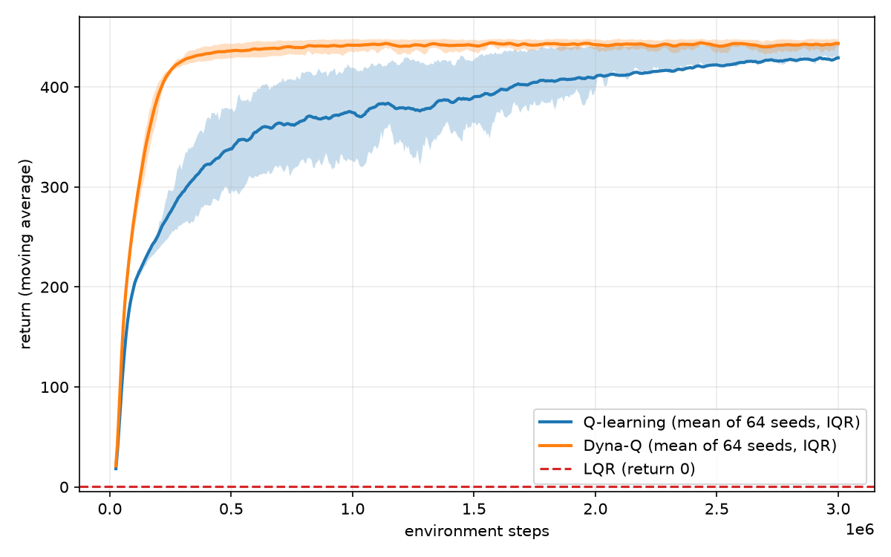
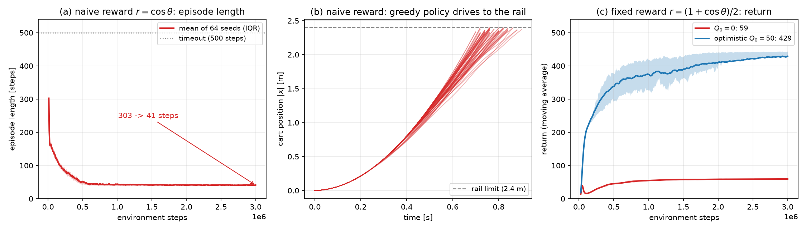

# 論理生命学 課題 石井先生担当分

学籍番号 6930377841 南川健志郎
2026年7月2日

# レポート課題2: カートポールの安定化制御

倒立振子 (カートポール) の安定化は, 不安定平衡点まわりの制御問題として制御理論・強化学習の双方で標準的なベンチマークである. 本レポートでは, カートポールの安定化制御を状態離散化に基づく表形式Q学習によって実現する. さらに発展課題として, カートポールの物理モデルをエージェントが内部に持ちプランニングに用いるモデルベース強化学習 (Dyna-Q) を実装し, モデルフリーな強化学習とのサンプル効率の比較を行う. 比較対象として, 同じ物理モデルから制御則を直接導出するLQR制御も用い, 三者の性質の違いを考察する. また倒立近傍という課題設定自体を取り払った振り上げ (swing-up) 課題を定義し, LQRが原理的に破綻する一方で強化学習が機能することを実験的に示す.

## 1 問題設定

### 1.1 安定化課題

水平方向に移動するカートの上に, 回転関節を介してポールが取り付けられている. カートに左右方向の力を加えることで, ポールを倒さないように直立状態を維持することが目的である. 各時刻 $t$ における変数を以下に定義する:

**観測 $s_t$**
　4次元の連続状態 $s_t = (x, \dot{x}, \theta, \dot{\theta})$. ここで $x$ はカート位置, $\dot{x}$ はカート速度, $\theta$ はポールの鉛直からの角度, $\dot{\theta}$ は角速度である.

**行動 $a_t$**
　カートに力 $F = \pm 10$ [N] を加える2値の操作 ($a_t \in \{0, 1\}$). 行動を受けて系は運動方程式に従い時間刻み $\Delta t = 0.02$ [s] だけ遷移し, 確率1で対応する観測 $s_{t+1}$ を得る.

**報酬 $r_t$**
　ポールが倒れずに1ステップ経過するごとに報酬1を与える. カート位置が $|x| > 2.4$ [m], またはポール角度が $|\theta| > 12°$ となった時点でエピソードを終端とする. また1エピソードの最大長は500ステップとした.

カートポールの運動方程式は, カート質量 $M$, ポール質量 $m$, ポール半長 $l$, 重力加速度 $g$ を用いて次式で表される:

$$\ddot{\theta} = \frac{g\sin\theta - \cos\theta \left( \dfrac{F + ml\dot{\theta}^2\sin\theta}{M+m} \right)}{l\left( \dfrac{4}{3} - \dfrac{m\cos^2\theta}{M+m} \right)}, \qquad \ddot{x} = \frac{F + ml(\dot{\theta}^2\sin\theta - \ddot{\theta}\cos\theta)}{M+m} \tag{1}$$

本実装では標準的なパラメータ $M=1.0$ [kg], $m=0.1$ [kg], $l=0.5$ [m], $g=9.8$ [m/s$^2$] を用いた.

### 1.2 swing-up課題

1.1節の課題は初期状態が倒立近傍に限られていた. 発展課題として, 真下に垂れ下がった状態 ($\theta = \pi$) からポールを振り上げて倒立させるswing-up課題を定義する.

初期状態は $\theta = \pi$ の近傍 (各変数に $\pm 0.05$ の一様ノイズ) とし, 報酬は倒立で1, 真下で0となる $r_t = (1 + \cos\theta)/2$ を毎ステップ与える. 角度による終端は設けず, エピソードは500ステップ (10秒) で打ち切る. したがって収益の最大値はおよそ500であり, 素早く振り上げて倒立を維持し続けるほど収益が大きくなる. 行動は安定化課題と同一の $\pm 10$ [N] の2値である.

環境の設計にあたっては2点の工夫を行った. 第一に報酬の非負化である. 素朴には倒立で1, 真下で $-1$ となる $\cos\theta$ を報酬とし, レール端 $|x| > 2.4$ で終端する設計が考えられるが, これは自滅方策を誘発する (4.4節). 毎ステップ負の報酬を受ける環境では, 早期に終端して負の蓄積を打ち切ることが収益最大化になってしまうためである. 報酬を非負とすることでこの縮退を除去した. 第二に, 式(1)の運動方程式が $x$ と $\dot{x}$ に依存しない (並進不変である) ことを利用し, レールが十分長いと仮定して位置による終端も設けなかった. これにより状態の離散化からカート位置を外すことができる.

## 2 アルゴリズム

### 2.1 Q学習

本課題の状態空間は4次元の連続空間である. そこで各状態次元を有限個の区間に離散化し, 表形式のQ学習を適用する. 各次元を $K$ 個の区間に等分割すると状態の総数は $K^4$ となり, $K=8$ のとき4096状態と表形式で十分扱える規模となる. swing-up課題では状態が並進不変であることから離散化を角度系 $(\theta, \dot{\theta})$ のみに限定し, 角度は $[-\pi, \pi]$ に折り返した上で64分割, 角速度は振り上げ時の大きな値を覆う $[-12, 12]$ [rad/s] を32分割として, 状態数は $64 \times 32 = 2048$ とした.

Q学習では, 行動価値関数 $Q(s, a)$ を次の更新則により学習する:

$$Q(s_t, a_t) \leftarrow Q(s_t, a_t) + \alpha \left( r_t + (1 - d_t)\, \gamma \max_{a'} Q(s_{t+1}, a') - Q(s_t, a_t) \right) \tag{2}$$

ここで $\alpha$ は学習率, $\gamma$ は割引率, $d_t$ は終端フラグである. 終端状態ではブートストラップ項を0とすることで, 「倒れると以後の報酬が得られない」ことが価値関数に正しく反映される. 行動選択には $\varepsilon$-greedy方策を用い, $\varepsilon$ は初期値1.0から指数的に減衰させ最小値0.05に漸近させる.

### 2.2 Dyna-Q

2.1節のQ学習は, 環境のダイナミクスを未知としてサンプルから方策を獲得するモデルフリーな手法である. これに対し, エージェントが環境のモデルを内部に持ち, モデルから生成した模擬経験によってもQ値を更新するモデルベース強化学習として, Dynaアーキテクチャに基づくDyna-Qを用いる. 一般にモデルベースRLではモデル自体をデータから学習する (システム同定, ニューラルダイナミクスモデルなど) が, 本課題ではカートポールの物理パラメータが既知であることを利用し, 式(1)の運動方程式そのものを内部モデルとして用いる. これは誤差のない完全なモデルを持つ場合に相当する.

Dyna-Qでは, 実環境との相互作用による通常のQ学習の更新 (直接RL) に加えて, 実環境の1ステップごとに $n$ 回のプランニングを行う. プランニングでは, 過去に訪問した状態をバッファからランダムにサンプルし, 無作為な行動を選び, 内部モデルにより遷移 $(s, a, r, s')$ を生成して式(2)のQ学習更新を適用する. 実環境との相互作用を増やすことなくQ値の更新回数を $n+1$ 倍にできるため, 環境ステップ数に対するサンプル効率の向上が期待できる. $n = 0$ のとき通常のQ学習と完全に一致する.

### 2.3 オプティミスティック初期化

swing-up課題の本質的な難しさは探索にある. 振り上げには振り子の共振に合わせてカートを往復させエネルギーを蓄積する必要があるが, ランダムな行動系列からこのような協調した力の入れ方が偶然生じることは稀である. さらに真下近傍では報酬 $(1+\cos\theta)/2$ の勾配がほぼ平坦であり, 学習信号が乏しい.

そこでswing-up課題ではQテーブルの初期値を真の価値の上界程度である50に設定するオプティミスティック初期化を用いる. 未訪問の状態行動対の価値が過大評価されるため, エージェントは「まだ試していない状態」へ系統的に誘導され, 訪問済みの価値が実態に修正されるにつれて探索の前線が押し広げられる.

### 2.4 LQR

比較対象として, 学習を用いない古典的手法である線形二次レギュレータ (LQR) も実装した. 式(1)を直立平衡点まわりで線形化して離散時間の状態方程式を求め, 二次形式の評価関数を最小化する状態フィードバック $u = -K\boldsymbol{x}$ を離散時間Riccati方程式の解として得る (重みは $Q = \mathrm{diag}(1,1,10,1)$, $R = 0.1$, 得られたゲインは $K = (-2.78, -5.32, -46.4, -12.0)$). 物理モデルが既知であれば試行錯誤を一切要さず制御則が定まるため, 強化学習の性能を測る基準として用いる. ただし線形近似に基づくため有効な範囲は倒立近傍に限られ, その限界は4.2節で測定する.

## 3 実装

プログラムは `env.py`, `agent.py`, `main.py` の3つからなる. 実装にはJAXを用い, 以下の方針を取った. プログラムの詳細な説明は避け, 重要な部分のみ述べる. 具体的なコードは添付のプログラムを参照されたい.

- **純粋関数化**: 環境・エージェントをクラスの内部状態として持たせるのではなく, 状態 (カートポールの状態ベクトル, Qテーブル, 乱数キー) をすべて関数の引数・返り値として陽に受け渡す.
- **学習ループのscan化**: エピソード単位のPythonループを用いず, 学習全体を単一の `jax.lax.scan` として記述する. エピソードの終端処理 (リセット) も `jnp.where` による分岐としてscan内に含める.
- **環境とseedの並列化**: 表形式Q学習の更新は1ステップあたり数個のスカラー演算しか行わないため, 逐次に実行すると計算資源をほとんど活用できない. そこで `jax.vmap` により, 1つのQテーブルを共有する64個の環境と, 独立した64個のseedを同時に進める. 前者により, 同じ環境ステップ数に対する逐次イテレーション数が64分の1になる. 複数の遷移を1つのQテーブルへ反映する方法は3.4節で述べる.
- **明示的な乱数管理**: 乱数キーを明示的に分割して用いる. これにより試行間の独立性と, seed値による実験条件の指定が明確になる. なお3.4節の一括更新はGPUのatomic加算を用いるため, 同一seedでも加算順序が実行ごとに変わり, 結果は1%程度変動する.

### 3.1 env.py

環境は式(1)の運動方程式を実装した純粋関数 `dynamics` を中心に構成される. 物理パラメータに加え, 初期状態・報酬・終端条件・角度の折り返しを `TaskConfig` として定義することで, 安定化とswing-upを同じ `reset`, `transition`, `step` 関数で扱う.

```python
def step(params: CartPoleParams, task: TaskConfig,
         state: jnp.ndarray, action: int):
    force = jnp.where(action == 1, params.force_mag, -params.force_mag)
    return transition(params, task, state, force)
```

積分には半陰的Euler法を用いた. これはGymnasiumのCartPole-v1と同一の離散化である.

### 3.2 agent.py

エージェントには状態の離散化, $\varepsilon$-greedy方策に基づく行動選択, Q学習の更新則を実装した. 離散化は各次元を設定 (`AgentConfig`) で与えた範囲と分割数で等分割し, 4次元のビン番号を1つの整数インデックスに変換する. 分割数と範囲を次元ごとに指定できるようにしてあるため, 2.1節で述べた課題ごとの離散化の違いは設定値の変更のみで実現でき, 学習コードは両課題で完全に共通である.

```python
def discretize(config: AgentConfig, state: jnp.ndarray) -> jnp.ndarray:
    """連続状態を離散状態インデックスへ変換する純粋関数"""
    low, high = jnp.array(config.state_low), jnp.array(config.state_high)
    n_bins = jnp.array(config.n_bins)
    ratio = (state - low) / (high - low)
    bins = jnp.clip((ratio * n_bins).astype(jnp.int32), 0, n_bins - 1)
    weights, w = [], 1
    for n in reversed(config.n_bins):  # 各次元のビン番号を1つの整数に合成
        weights.append(w)
        w *= n
    return jnp.dot(bins, jnp.array(weights[::-1]))
```

Q学習の更新は式(2)をそのまま実装したものであり, JAXのイミュータブルな配列更新 `q_table.at[...].add(...)` により新しいQテーブルを返す純粋関数として記述した.

```python
def update(config, q_table, state, action, reward, next_state, done):
    s_idx = discretize(config, state)
    ns_idx = discretize(config, next_state)
    target = reward + (1.0 - done) * config.gamma * jnp.max(q_table[ns_idx])
    td_error = target - q_table[s_idx, action]
    return q_table.at[s_idx, action].add(config.alpha * td_error)
```

### 3.3 共通学習ループ

`agent.py` の `train_vec` 関数は課題設定と学習設定を引数に取り, 学習ループ全体を `jax.jit` でコンパイルする. 安定化とswing-up, 通常のQ学習とDyna-Qはすべてこの関数を共有する. scanの1イテレーションで `num_envs` 個の環境がそれぞれ1ステップ進み, 得られた `num_envs` 件の遷移が共有のQテーブルへ反映される.

```python
def scan_step(carry, iteration):
    q_table, states, ep_return, ep_steps, key = carry
    key, key_act, key_reset = jax.random.split(key, 3)
    step_count = iteration * num_envs  # epsilonの減衰は環境ステップ基準で揃える

    # num_envs個の環境を同時に進める (Qテーブルは全環境で共有)
    actions = jax.vmap(select_action, in_axes=(None, None, 0, None, 0))(
        config, q_table, states, step_count,
        jax.random.split(key_act, num_envs))
    next_states, rewards, dones = jax.vmap(
        env.step, in_axes=(None, None, 0, 0))(params, task, states, actions)
    q_table = batched_update(config, q_table, states, actions,
                             rewards, next_states, dones.astype(jnp.float32))

    ep_return = ep_return + rewards
    finished = dones | (ep_steps + 1 >= training.max_episode_steps)
    fresh = jax.vmap(env.reset, in_axes=(None, 0))(
        task, jax.random.split(key_reset, num_envs))
    states = jnp.where(finished[:, None], fresh, next_states)
    out = (finished, ep_return)
    ep_return = jnp.where(finished, 0.0, ep_return)
    ep_steps = jnp.where(finished, 0, ep_steps + 1)
    return (q_table, states, ep_return, ep_steps, key), out
```

Dyna-Qのプランニングは, 上記の実環境のステップ処理の直後に追加される. 内部モデルとしては環境の `step` 関数をそのまま呼び出している点に注意されたい (エージェントが環境と同一の物理モデルを持つことに対応する). プランニング回数 `planning_steps` は `TrainingConfig` で指定する.

プランニングは $n$ 回の逐次ループとしても書けるが, 本実装では3.4節の `batched_update` により $n \times \mathrm{num\_envs}$ 件の模擬経験を一括で反映する. 逐次ループでは1イテレーションあたり $n+1$ 回のカーネル起動が直列に並ぶため, $n=20$ では1イテレーションの所要時間が約13倍に増大したのに対し, 一括化により約8倍高速化された.

```python
# --- 内部モデルによるプランニング ---
# 過去に訪問した状態と無作為な行動から, 物理モデルで遷移を生成しQ値を更新する
if training.planning_steps > 0:
    slots = (step_count + jnp.arange(num_envs)) % training.buffer_size
    buffer = buffer.at[slots].set(states)
    valid = jnp.minimum(step_count + num_envs, training.buffer_size)
    # 環境ステップあたりのプランニング回数を逐次実装と揃える
    n_plan = training.planning_steps * num_envs

    k1, k2 = jax.random.split(key_plan)
    plan_s = buffer[jax.random.randint(k1, (n_plan,), 0, valid)]
    plan_a = jax.random.randint(k2, (n_plan,), 0, config.n_actions)
    plan_ns, plan_r, plan_d = jax.vmap(  # モデルによる模擬経験
        env.step, in_axes=(None, None, 0, 0))(params, task, plan_s, plan_a)
    q_table = batched_update(config, q_table, plan_s, plan_a, plan_r,
                             plan_ns, plan_d.astype(jnp.float32))
```

今回は64回の試行を別々のseed値で行い, 学習が特定のseed値に依存していないかを確認した.

なお, 各環境のエピソード経過ステップ数の初期値は環境ごとにずらしてある. 揃えたままにすると, 角度による終端を持たないswing-up課題では全エピソードが正確に500ステップとなるため64環境が永久に同位相となり, エピソードの終了が $64 \times 500 = 32000$ 環境ステップごとにしか発生しない. 実際, 300万ステップの学習で収益が記録される時点が93箇所しかなく, 学習曲線が階段状になっていた. 初期位相をずらすことで記録点は6000箇所となる.

### 3.4 複数遷移の一括更新

複数の遷移をまとめてQテーブルへ反映する `batched_update` は, 式(2)を単純にベクトル化したものではない. 表形式Q学習では1回の更新が触るのはQテーブルの1セル $Q(s,a)$ のみであり, 深層強化学習のミニバッチのように損失を平均する縮約は起こらない. バッチはあくまで複数セルへの分散書き込みである. ただし逐次実行との差が2点生じる.

第一に, バッチ内のすべての遷移が更新前のQテーブルでブートストラップする. 逐次実行では $Q(s')$ の更新が次のステップの $\max_{a'}Q(s',a')$ に即座に反映され, 軌道に沿って1ステップごとに価値が1ホップ逆流するが, 並列実行では1イテレーションあたり1ホップに留まる. 第二に, バッチ内に同一の $(s,a)$ が複数含まれうる. TD誤差を単純に加算すると実効学習率が重複数倍となり $\alpha \times (\text{重複数}) > 1$ で発散しうるため, 本実装では重複数で割った平均を適用した. バッチサイズ1のとき `batched_update` は式(2)と厳密に一致する.

```python
def batched_update(config, q_table, states, actions,
                   rewards, next_states, dones):
    s_idx = jax.vmap(discretize, in_axes=(None, 0))(config, states)
    ns_idx = jax.vmap(discretize, in_axes=(None, 0))(config, next_states)
    target = rewards + (1.0 - dones) * config.gamma * jnp.max(q_table[ns_idx], axis=-1)
    td_error = target - q_table[s_idx, actions]
    flat = s_idx * config.n_actions + actions  # (状態, 行動) を1次元へ
    total = jnp.zeros(q_table.size).at[flat].add(config.alpha * td_error)
    count = jnp.zeros(q_table.size).at[flat].add(1.0)
    return q_table + (total / jnp.maximum(count, 1.0)).reshape(q_table.shape)
```

## 4 結果

### 4.1 安定化課題

通常のQ学習 ($n=0$) とDyna-Q ($n=20$) をそれぞれ64のseed値で60万環境ステップ学習させた結果を図1に示す. 学習率は $\alpha = 0.1$, 割引率は $\gamma = 0.99$ とし, 両手法の条件を揃えるため $\varepsilon$ の減衰時定数は共通の50000ステップとした. 実線は64試行の平均, 帯は四分位範囲, 赤の破線は比較対象であるLQRの収益である.


**図1** モデルフリーなQ学習とモデルベースなDyna-Qの学習曲線の比較 (各64試行, 帯は四分位範囲, 赤破線はLQR)

まずQ学習について述べる. 学習初期 (2万ステップ程度まで) は数十ステップで倒れていたポールが, 学習の進行とともに数百ステップ維持できるようになっており, どのseedでも安定化方策が学習できている. 最終的な移動平均は64seedの平均で約244, 第1〜第9十分位で179〜313であった.

一方で, 学習した方策は必ずしもエピソード最大長を通してポールを維持できるわけではない. 学習後のQテーブルによる貪欲方策を初期状態 $(0,0,0,0)$ から評価すると, 生存ステップ数の中央値は328であり, エピソード最大長である500ステップに到達したのは64seed中8%にとどまった. すなわち移動平均が250前後で頭打ちになるのは学習の未収束ではなく, 獲得された方策自体が一定の確率で失敗することを反映している. これは状態の離散化により, 同一の離散状態に制御上異なる対応が必要な連続状態が混在すること (状態エイリアシング) が原因と考えられる. 分割数を増やせば解像度は上がるが, 状態数が $K^4$ で増加し各状態の訪問頻度が下がるため学習が遅くなるというトレードオフがある.

次にDyna-Qとの比較である. 環境5万ステップ時点での移動平均はQ学習の99に対しDyna-Qは120であり, 同一の環境経験量でより高い性能に到達している. 差は学習の進行とともに拡大し, 20万ステップ時点では218に対し335, 最終的には約244に対し約350となった. 64試行の四分位範囲は学習の中盤以降ほぼ重ならず, この優位はseedのばらつきでは説明できない. これはプランニングにより, 実際に訪問した状態まわりの価値情報がQテーブル全体へ速く伝播するためである. 特にカートポールのような報酬が終端 (失敗) によって定まる課題では, 失敗経験の周辺状態への価値の伝播が学習速度を左右するため, モデルによる更新回数の増加が直接サンプル効率に効いている. 貪欲方策の500ステップ到達率もQ学習の8%に対しDyna-Qは30%であった.

ただし両手法とも, 学習を一切行わないLQRが達成する収益500 (図1の赤破線, エピソード最大長に相当) には遠く及ばない. 倒立近傍に限れば, モデルが既知である以上は制御則を直接解く方が圧倒的に有利である. また実環境1ステップあたりの計算量はプランニング回数に比例して増加する. すなわちモデルベースRLは「環境との相互作用のコスト」を「計算コスト」に振り替える手法であるといえ, 実ロボットのように環境ステップが高価な場合に特に有効である. なお本実装は完全なモデルを用いたが, モデルを学習する場合にはモデル誤差が模擬経験を通じて価値関数に混入する (モデルバイアス) ため, この結果はモデルベースRLの上限性能を示すものと解釈できる.

### 4.2 LQRの吸引領域

2.4節で述べた通り, LQRは直立平衡点まわりの線形近似に基づくため有効な範囲が限られる. その範囲を測定するため, 初期角度を10°から70°まで振り, 30秒のシミュレーションで直立平衡点に収束するか (吸引領域) を実測した. 判定は途中で $|\theta| > 90°$ となれば失敗, 最終的に $|\theta| < 1°$ かつ $|x| < 0.1$ [m] であれば成功とした.

環境と同じ $\pm 10$ [N] の入力制限下では初期角度30°までしか成功せず, 40°以降は入力飽和により失敗した. 入力制限を外しても成功は60°までであり, さらに50°以上ではカートの最大移動量が2.8 m以上とレール制限 $\pm 2.4$ [m] を超える. すなわち環境の制約下での実質的な吸引領域は初期角度30〜40°程度である. 4.1節で見たLQRの圧倒的な性能は, 課題設定が線形近似の有効な倒立近傍に限定されていることに強く依存している.

### 4.3 swing-up課題

$\theta = 180°$ からの振り上げは, 4.2節で測定した吸引領域を大きく外れた大域的に非線形な課題である. 図2に64のseed値による学習曲線を示す. 図の見方は図1と同じである.



**図2** swing-up課題における学習曲線 (64試行, オプティミスティック初期化あり. 赤破線はLQR)

Q学習の最終的な移動平均は第1〜第9十分位で約410〜445であり, 大半のseedで学習が成功している. ただし安定化課題と異なり分布の裾は長く, 最も悪いseedでは310程度にとどまった. 振り上げの成否が探索の初期に決まりやすいことを反映していると考えられる. 赤の破線が示す通り, 同じ課題でLQRの収益はほぼ0である.

Dyna-Qの優位は安定化課題よりも顕著である. 移動平均が400に達するまでにQ学習は166万ステップを要するのに対しDyna-Qは22万ステップ, 420に達するまでではそれぞれ242万ステップと27万ステップであり, 7〜9倍のサンプル効率の差がある. Q学習の平均は300万ステップを通じて430に届かないのに対し, Dyna-Qは34万ステップでこれを超える. 最終的な移動平均も443 (64試行の標準偏差6.6) 対 429 (同29.3) とDyna-Qが上回り, seed間のばらつきも小さい. 探索が困難な課題ほどモデルによる価値の伝播が効くことを示している.

図3に, ほぼ真下の同一初期状態 $(\theta_0 = \pi - 0.05)$ から, 学習後の貪欲方策とLQR (入力を $\pm 10$ [N] に制限) を適用したポール角度の軌道を示す.


**図3** 真下の初期状態からのポール角度の軌道. 角度は折り返さずに追っており, 0°と360°がともに倒立, 180°が真下に対応する.

両者の差は決定的である. Q学習の貪欲方策は振り子を数回往復させてエネルギーを蓄積し, 開始から1.60秒で倒立近傍 ($|\theta| < 12°$) に到達, 以降エピソード終了までの滞在率は100%, 最終100ステップの平均偏差は5°程度であった. すなわち振り上げとその後の倒立維持の両方を単一のQテーブルで実現している. 一方LQRは到達した最小の $|\theta|$ が177.1°であり, 真下近傍から一度も離れることができなかった.

LQRの破綻は原理的なものである. 第一に, 直立点まわりの線形化モデルは $\theta = \pi$ 近傍では現実と大きく乖離しており, 重力の作用の向きすら逆になる (直立近傍では倒れる向きに働く重力が, 真下近傍では復元力として働く). その結果, 線形フィードバックは真下という安定平衡点まわりの小振動に吸い込まれてしまう. 第二に, 振り上げには「一時的に報酬 (ポールの高さ) を下げてでも反対側へ振ってエネルギーを蓄える」という非単調な戦略が必要であり, 偏差を単調に減らそうとする線形状態フィードバック $u = -Kx$ の形式ではこれを表現できない. これに対し強化学習は, ダイナミクスの大域的な非線形性を前提とせず, 収益最大化という目的だけから試行錯誤によって振り上げ戦略を発見できる.

### 4.4 報酬設計と探索の設計

1.2節で述べた報酬の非負化と, 2.3節で述べたオプティミスティック初期化は, いずれもswing-up課題を成立させるための設計判断である. それぞれを外した場合に何が起きるかを測定した結果を図4に示す.



**図4** swing-up課題における報酬設計と探索の設計の効果. (a) 素朴な報酬でのエピソード長の推移 (64試行の平均, 帯は四分位範囲), (b) その学習後の貪欲方策によるカート位置の軌道 (64seed分), (c) 報酬を非負化した上でのQ値初期化の比較.

**報酬の非負化.** 素朴な設計として報酬を $\cos\theta$, 終端条件をレール端 $|x| > 2.4$ [m] とした設定で学習させた. レール端が終端条件となる以上エージェントは自分の位置を知覚する必要があるため, 状態の離散化にカート位置を8分割で加えている (この設定はオプティミスティック初期化の導入前に相当するため $Q_0 = 0$ とした). 図4(a)の通り, 1エピソードの長さは学習初期の303ステップから41ステップへ単調に減少した. すなわちエージェントは可能な限り早くエピソードを終わらせることを学習している.

図4(b)に学習後の貪欲方策の軌道を示す. 64seedすべてがカートを一方向に加速させ, 0.9秒以内にレール端 $|x| = 2.4$ [m] へ到達してエピソードを終了させている. この間ポールは一度も鉛直下向きの半平面を離れず (終端時の $|\theta|$ は平均108°), 収益は $-25.2$ であった. 毎ステップ $\cos\theta \approx -1$ の負の報酬を受ける設計では, 振り上げを学習するよりも早く自滅するほうが収益が高くなる. 報酬設計の典型的な罠であり, 報酬を $(1+\cos\theta)/2$ と非負化することでこの縮退は除去される.

**探索の設計.** 報酬を非負化しても, それだけでは学習は成立しない. Qテーブルをゼロで初期化した通常の設定では, 300万ステップ学習しても移動平均は59.4 (64試行の標準偏差0.8, 収益の最大値は500) で停滞し, 全試行が一様に失敗した (図4(c)の赤線). 貪欲方策は一度も倒立近傍に到達しない. これは2.3節で述べた通り, ランダムな行動系列から振り子の共振に合わせたポンピングが生じることが稀であり, かつ真下近傍では報酬の勾配がほぼ平坦で学習信号が乏しいためである. Qテーブルの初期値を50とするオプティミスティック初期化を加えるだけで移動平均は約429に達する (同図の青線). この課題の成否を分けているのは報酬と探索の設計であり, 学習アルゴリズム自体は両者で同一である.

### 4.5 3手法の比較

以上より, 本レポートで扱った3手法はモデルの利用度が異なるスペクトルとして整理できる. モデルフリーなQ学習はモデルを一切用いず数十万ステップの試行錯誤を要する. Dyna-Qは既知のモデルを模擬経験の生成に用いて環境との相互作用を削減するが, 制御則そのものは依然としてQ学習により獲得するため, 離散化や探索に起因する限界は残る. LQRはモデルの構造を直接利用するためサンプルを一切必要とせず, 倒立近傍では両者を大きく上回る (図1の赤破線) 一方, 線形近似が破綻する領域では全く機能しない (図2の赤破線). モデルが不正確・未知な場合にも適用できる点が強化学習の本質的な利点であり, モデルの知識をどの段階で・どの程度利用するかに応じて3手法は相補的な関係にあるといえる.

## 5 授業の感想

（※ここはご自身の言葉で記入してください）

## プログラムリスト

- `env.py`: カートポール環境 (安定化・swing-up) の純粋関数群
- `agent.py`: 表形式Q学習とDyna-Qの共通学習ループ `train_vec`, 並列更新 `batched_update`, LQR (状態離散化, 学習更新, 線形化, Riccati方程式の求解, 吸引領域の探索)
- `main.py`: 2つの課題設定と3つの制御手法の総当たり実行, 結果の比較とグラフ描画
