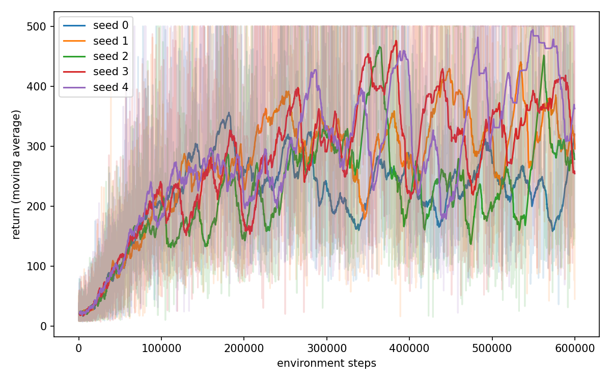
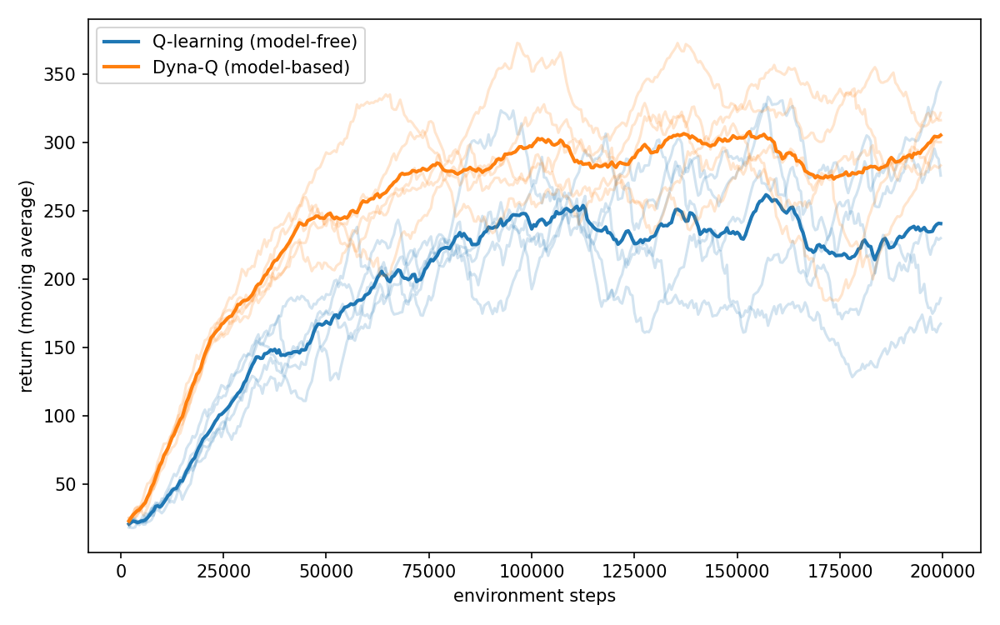
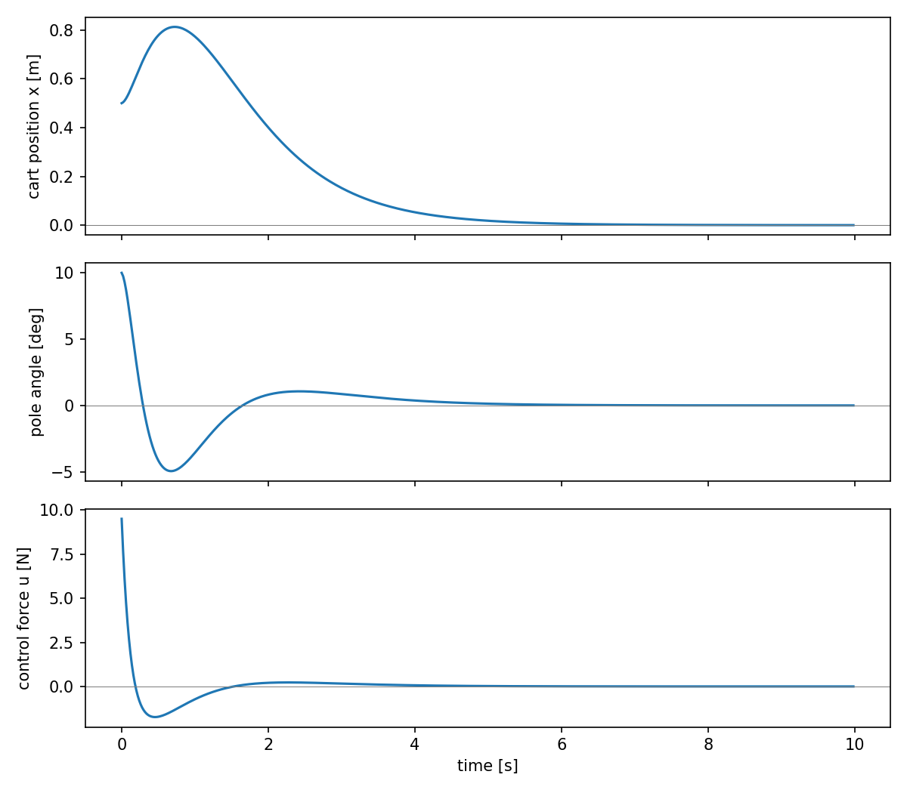
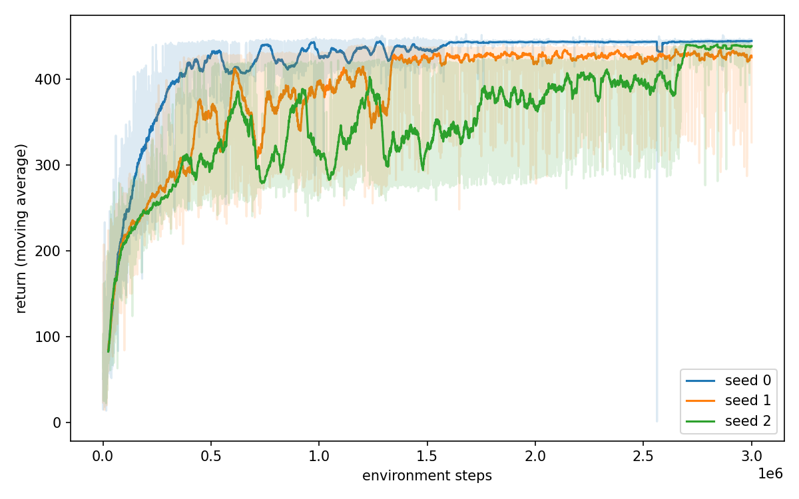
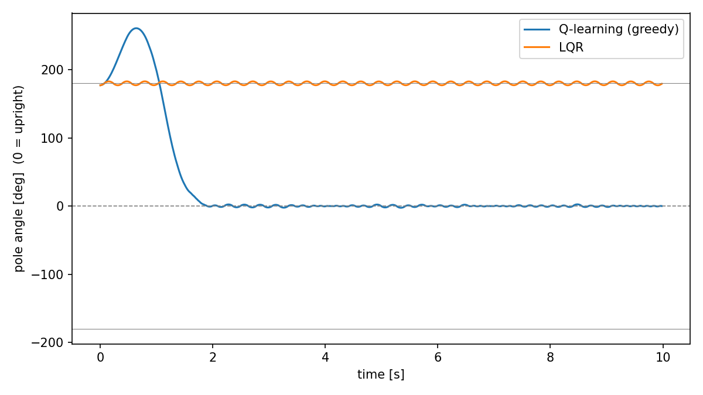

# 論理生命学 課題 石井先生担当分

学籍番号 6930377841 南川健志郎
2026年7月2日

# レポート課題2: カートポールの安定化制御

倒立振子 (カートポール) の安定化は, 不安定平衡点まわりの制御問題として制御理論・強化学習の双方で標準的なベンチマークである. 本レポートでは, カートポールの安定化制御を状態離散化に基づく表形式Q学習によって実現する. 実装には数値計算ライブラリJAXを用い, 純粋関数とJITコンパイルを活用した高速な学習を行う. さらに発展課題として, カートポールの物理モデルをエージェントが内部に持ちプランニングに用いるモデルベース強化学習 (Dyna-Q) を実装し, モデルフリーな強化学習とのサンプル効率の比較を行う. 加えて, 同じ物理モデルから制御理論的に制御則を直接導出するLQR制御も実装し, 三者の性質の違いを考察する. 最後に, 倒立近傍という課題設定自体を取り払った振り上げ (swing-up) 課題を定義し, LQRが原理的に破綻する一方で強化学習が機能することを実験的に示す.

## 1 問題設定: カートポールの安定化

水平方向に移動するカートの上に, 回転関節を介してポールが取り付けられている. カートに左右方向の力を加えることで, ポールを倒さないように直立状態を維持することが目的である. 各時刻 $t$ における変数を以下に定義する:

**観測 $s_t$**
　4次元の連続状態 $s_t = (x, \dot{x}, \theta, \dot{\theta})$. ここで $x$ はカート位置, $\dot{x}$ はカート速度, $\theta$ はポールの鉛直からの角度, $\dot{\theta}$ は角速度である.

**行動 $a_t$**
　カートに力 $F = \pm 10$ [N] を加える2値の操作 ($a_t \in \{0, 1\}$). 行動を受けて系は運動方程式に従い時間刻み $\Delta t = 0.02$ [s] だけ遷移し, 確率1で対応する観測 $s_{t+1}$ を得る.

**報酬 $r_t$**
　ポールが倒れずに1ステップ経過するごとに報酬1を与える. カート位置が $|x| > 2.4$ [m], またはポール角度が $|\theta| > 12°$ となった時点でエピソードを終端とする. また1エピソードの最大長は500ステップとした.

カートポールの運動方程式は, カート質量 $M$, ポール質量 $m$, ポール半長 $l$, 重力加速度 $g$ を用いて次式で表される:

$$\ddot{\theta} = \frac{g\sin\theta - \cos\theta \left( \dfrac{F + ml\dot{\theta}^2\sin\theta}{M+m} \right)}{l\left( \dfrac{4}{3} - \dfrac{m\cos^2\theta}{M+m} \right)}, \qquad \ddot{x} = \frac{F + ml(\dot{\theta}^2\sin\theta - \ddot{\theta}\cos\theta)}{M+m} \tag{1}$$

本実装では標準的なパラメータ $M=1.0$ [kg], $m=0.1$ [kg], $l=0.5$ [m], $g=9.8$ [m/s$^2$] を用いた.

## 2 アルゴリズム

本課題の状態空間は4次元の連続空間である. そこで各状態次元を有限個の区間に離散化し, 表形式のQ学習を適用する. 各次元を $K$ 個の区間に等分割すると状態の総数は $K^4$ となり, $K=8$ のとき4096状態と表形式で十分扱える規模となる.

Q学習では, 行動価値関数 $Q(s, a)$ を次の更新則により学習する:

$$Q(s_t, a_t) \leftarrow Q(s_t, a_t) + \alpha \left( r_t + (1 - d_t)\, \gamma \max_{a'} Q(s_{t+1}, a') - Q(s_t, a_t) \right) \tag{2}$$

ここで $\alpha$ は学習率, $\gamma$ は割引率, $d_t$ は終端フラグである. 終端状態ではブートストラップ項を0とすることで, 「倒れると以後の報酬が得られない」ことが価値関数に正しく反映される. 行動選択には $\varepsilon$-greedy方策を用い, $\varepsilon$ は初期値1.0から指数的に減衰させ最小値0.05に漸近させる.

## 3 JAXによる実装方針

実装にはJAXを用いた. JAXは副作用を持たない純粋関数に対してJITコンパイル (XLAによる最適化) を適用することで高速な数値計算を実現するライブラリであり, 本実装では以下の方針を取った.

- **純粋関数化**: 環境・エージェントをクラスの内部状態として持たせるのではなく, 状態 (カートポールの状態ベクトル, Qテーブル, 乱数キー) をすべて関数の引数・返り値として陽に受け渡す純粋関数として実装する.
- **学習ループ全体のJIT化**: エピソード単位のPythonループを用いず, 学習全体を単一の `jax.lax.scan` として記述する. エピソードの終端処理 (リセット) も `jnp.where` による分岐としてscan内に含めることで, 60万ステップの学習ループ全体が1つの計算グラフとしてコンパイルされる.
- **明示的な乱数管理**: JAXの乱数は乱数キーを明示的に分割して用いる. これにより実験の再現性がseed値のみで完全に定まる.

この方針により, 60万ステップ × 5試行の学習が数秒で完了する.

## 4 実装

プログラムは `env.py`, `agent.py`, `main.py` の3つからなる. プログラムの詳細な説明は避け, 重要な部分を説明する. 具体的なコードは添付のプログラムを参照されたい.

### 4.1 env.py

環境は式(1)の運動方程式を実装した純粋関数 `dynamics` を中心に構成される. 物理パラメータに加え, 初期状態・報酬・終端条件・角度の折り返しを `TaskConfig` として定義することで, 安定化とswing-upを同じ `reset`, `transition`, `step` 関数で扱う.

```python
def step(params: CartPoleParams, task: TaskConfig,
         state: jnp.ndarray, action: int):
    force = jnp.where(action == 1, params.force_mag, -params.force_mag)
    return transition(params, task, state, force)
```

積分には半陰的Euler法を用いた. これはGymnasiumのCartPole-v1と同一の離散化である.

### 4.2 agent.py

エージェントには状態の離散化, $\varepsilon$-greedy方策に基づく行動選択, Q学習の更新則を実装した. 離散化は各次元を設定 (`AgentConfig`) で与えた範囲と分割数で等分割し, 4次元のビン番号を1つの整数インデックスに変換する. 分割数と範囲を次元ごとに指定できるようにしてあり, 安定化課題では全次元8分割を用いる (後述のswing-up課題では角度系のみを細かく分割する).

```python
def discretize(config: AgentConfig, state: jnp.ndarray) -> jnp.ndarray:
    """連続状態を離散状態インデックスへ変換する純粋関数"""
    low, high = jnp.array(config.state_low), jnp.array(config.state_high)
    n_bins = jnp.array(config.n_bins)
    ratio = (state - low) / (high - low)
    bins = jnp.clip((ratio * n_bins).astype(jnp.int32), 0, n_bins - 1)
    weights, w = [], 1
    for n in reversed(config.n_bins):  # 各次元のビン番号を1つの整数に合成
        weights.append(w)
        w *= n
    return jnp.dot(bins, jnp.array(weights[::-1]))
```

Q学習の更新は式(2)をそのまま実装したものであり, JAXのイミュータブルな配列更新 `q_table.at[...].add(...)` により新しいQテーブルを返す純粋関数として記述した.

```python
def update(config, q_table, state, action, reward, next_state, done):
    s_idx = discretize(config, state)
    ns_idx = discretize(config, next_state)
    target = reward + (1.0 - done) * config.gamma * jnp.max(q_table[ns_idx])
    td_error = target - q_table[s_idx, action]
    return q_table.at[s_idx, action].add(config.alpha * td_error)
```

### 4.3 共通学習ループ

`agent.py` の `train` 関数は課題設定と学習設定を引数に取り, 学習ループ全体を `jax.jit` でコンパイルする. 安定化とswing-up, 通常のQ学習とDyna-Qはすべてこの関数を共有する.

```python
def scan_step(carry, step_count):
    q_table, state, ep_return, ep_steps, key = carry
    key, key_act, key_reset = jax.random.split(key, 3)

    action = agent.select_action(config, q_table, state, step_count, key_act)
    next_state, reward, done = env.step(params, task, state, action)
    timeout = ep_steps + 1 >= training.max_episode_steps
    q_table = agent.update(config, q_table, state, action, reward,
                           next_state, done.astype(jnp.float32))

    ep_return = ep_return + reward
    finished = done | timeout
    state = jnp.where(
        finished, env.reset(task, key_reset), next_state)
    out = (finished, ep_return)
    ep_return = jnp.where(finished, 0.0, ep_return)
    ep_steps = jnp.where(finished, 0, ep_steps + 1)
    return (q_table, state, ep_return, ep_steps, key), out
```

今回は5回の試行を別々のseed値で行い, 学習が特定のseed値に依存していないかを確認した.

## 5 結果

図1に5回の試行における学習曲線を示す. 薄い線は各エピソードの実際の累積報酬を, 濃い線はその移動平均 (窓幅50エピソード) を表す. 横軸は環境におけるステップ回数である. 学習率は $\alpha = 0.1$, 割引率は $\gamma = 0.99$, 総学習ステップ数は60万とした.



**図1** 5回の試行における学習曲線

この図から, いずれのseed値においても学習初期 (2万ステップ程度まで) は数十ステップで倒れていたポールが, 学習の進行とともに数百ステップ維持できるようになっており, どのseedでも安定化方策が学習できていることが確認できる. 最終的な移動平均は250〜360程度であった. また学習後のQテーブルを用いた貪欲方策で評価したところ, エピソード最大長である500ステップの間ポールを倒さずに維持できることを確認した.

一方で学習後も累積報酬の分散は大きく, エピソードによっては早期に倒れる場合がある. これは状態の離散化により, 同一の離散状態に制御上異なる対応が必要な連続状態が混在すること (状態エイリアシング) が原因と考えられる. 分割数を増やせば解像度は上がるが, 状態数が $K^4$ で増加し各状態の訪問頻度が下がるため学習が遅くなるというトレードオフがある.

## 6 モデルベースRL: Dyna-Qによる学習の高速化

第5節までのQ学習は, 環境のダイナミクスを未知としてサンプルから方策を獲得するモデルフリーな手法であった. 本節では, エージェントが環境のモデルを内部に持ち, モデルから生成した模擬経験によってもQ値を更新するモデルベース強化学習を実装する. 具体的にはDynaアーキテクチャに基づくDyna-Qを用いる. 一般にモデルベースRLではモデル自体をデータから学習する (システム同定, ニューラルダイナミクスモデルなど) が, 本課題ではカートポールの物理パラメータが既知であることを利用し, 式(1)の運動方程式そのものを内部モデルとして用いる. これは誤差のない完全なモデルを持つ場合に相当する.

### 6.1 アルゴリズム

Dyna-Qでは, 実環境との相互作用による通常のQ学習の更新 (直接RL) に加えて, 実環境の1ステップごとに $n$ 回のプランニングを行う. プランニングでは, 過去に訪問した状態をバッファからランダムにサンプルし, 無作為な行動を選び, 内部モデルにより遷移 $(s, a, r, s')$ を生成して式(2)のQ学習更新を適用する. 実環境との相互作用を増やすことなくQ値の更新回数を $n+1$ 倍にできるため, 環境ステップ数に対するサンプル効率の向上が期待できる.

実装では, 実環境のステップ処理の直後にプランニングのループを `jax.lax.scan` として追加した. 内部モデルとしては環境の `step` 関数をそのまま呼び出している点に注意されたい (エージェントが環境と同一の物理モデルを持つことに対応する). プランニング回数 `planning_steps` は `TrainingConfig` で指定し, `planning_steps = 0` のとき第5節の通常のQ学習と完全に一致する.

```python
# --- 内部モデルによるプランニング ---
# 過去に訪問した状態と無作為な行動から, 物理モデルで遷移を生成しQ値を更新する
if training.planning_steps > 0:
    valid = jnp.minimum(step_count + 1, training.buffer_size)

    def plan_step(q, key_p):
        k1, k2 = jax.random.split(key_p)
        s = buffer[jax.random.randint(k1, (), 0, valid)]
        a = jax.random.randint(k2, (), 0, config.n_actions)
        s_next, r, d = env.step(params, task, s, a)  # モデルによる模擬経験
        return agent.update(config, q, s, a, r, s_next,
                            d.astype(jnp.float32)), None

    q_table, _ = jax.lax.scan(
        plan_step, q_table,
        jax.random.split(key_plan, training.planning_steps))
```

### 6.2 結果と考察

通常のQ学習 ($n=0$) とDyna-Q ($n=20$) をそれぞれ5つのseed値で20万環境ステップ学習させた結果を図2に示す. 薄い線は各試行の移動平均を, 濃い線は5試行の平均を表す. 両手法の条件を揃えるため, $\varepsilon$ の減衰時定数は共通の15000ステップとした.



**図2** モデルフリーなQ学習とモデルベースなDyna-Qの学習曲線の比較 (各5試行)

環境5万ステップ時点での移動平均はQ学習の169に対しDyna-Qは246であり, 同一の環境経験量でより高い性能に到達している. 最終的にも241に対し305と優位が保たれた. これはプランニングにより, 実際に訪問した状態まわりの価値情報がQテーブル全体へ速く伝播するためである. 特にカートポールのような報酬が終端 (失敗) によって定まる課題では, 失敗経験の周辺状態への価値の伝播が学習速度を左右するため, モデルによる更新回数の増加が直接サンプル効率に効いている.

一方で, 実環境1ステップあたりの計算量はプランニング回数に比例して増加する. すなわちモデルベースRLは「環境との相互作用のコスト」を「計算コスト」に振り替える手法であるといえる. 実ロボットのように環境ステップが高価な場合に特に有効である. また本実装は完全なモデルを用いたが, モデルを学習する場合にはモデル誤差が模擬経験を通じて価値関数に混入する (モデルバイアス) ため, この結果はモデルベースRLの上限性能を示すものと解釈できる.

## 7 モデルベース制御: LQRによる安定化

前節のDyna-Qは物理モデルを模擬経験の生成に用いたが, モデルが既知であれば, 学習を介さずに制御則を直接導出することもできる. 本節では制御理論的なアプローチとして, 直立平衡点まわりで運動方程式を線形化し, 線形二次レギュレータ (LQR) による状態フィードバック制御を設計する.

### 7.1 線形化とLQRの設計

式(1)を直立平衡点 $(\theta, \dot{\theta}) = (0, 0)$ まわりで $\sin\theta \approx \theta$, $\cos\theta \approx 1$, $\dot{\theta}^2 \approx 0$ と近似すると, 状態 $\boldsymbol{x} = (x, \dot{x}, \theta, \dot{\theta})^\top$, 入力 $u = F$ に関する線形状態方程式 $\dot{\boldsymbol{x}} = A_c \boldsymbol{x} + B_c u$ が得られる. これをEuler近似により離散化し ($A = I + A_c \Delta t$, $B = B_c \Delta t$), 二次形式の評価関数

$$J = \sum_{k=0}^{\infty} \left( \boldsymbol{x}_k^\top Q \boldsymbol{x}_k + u_k^\top R u_k \right) \tag{3}$$

を最小化する状態フィードバック $u_k = -K\boldsymbol{x}_k$ を求める. 最適ゲイン $K$ は離散時間Riccati方程式

$$P = Q + A^\top P A - A^\top P B (R + B^\top P B)^{-1} B^\top P A \tag{4}$$

の解 $P$ から定まる. 本実装では式(4)を不動点反復により解いた. この反復も `jax.lax.scan` により記述でき, 全体がJITコンパイルされる.

```python
def solve_dare(A, B, Q, R, iterations=500):
    """離散時間Riccati方程式を不動点反復で解き, フィードバックゲインKを返す"""
    def body(P, _):
        K = jnp.linalg.solve(R + B.T @ P @ B, B.T @ P @ A)
        P_next = Q + A.T @ P @ (A - B @ K)
        return P_next, None

    P, _ = jax.lax.scan(body, Q, None, length=iterations)
    K = jnp.linalg.solve(R + B.T @ P @ B, B.T @ P @ A)
    return K
```

重みは角度の偏差を重視して $Q = \mathrm{diag}(1, 1, 10, 1)$, $R = 0.1$ とした. 得られたフィードバックゲインは $K = (-2.78, -5.32, -46.4, -12.0)$ であり, 角度に対するゲインが支配的である.

### 7.2 結果と考察

設計したLQR制御器を, 線形化前の非線形ダイナミクス (式(1)) に適用した. 強化学習では扱えなかった大きな初期偏差として, カート位置 $x_0 = 0.5$ [m], ポール角度 $\theta_0 = 10°$ から制御を開始した結果を図3に示す.



**図3** LQRによる非線形カートポールの安定化 (上: カート位置, 中: ポール角度, 下: 制御入力)

ポール角度は1秒以内にほぼ0に収束し, カート位置も約4秒で原点に復帰した. 最終状態の偏差は $10^{-4}$ オーダーであり, 平衡点への漸近安定化が達成されている. 線形化に基づく制御器であるにもかかわらず, $10°$ という比較的大きな初期角度からでも安定化できており, 平衡点近傍では線形近似が十分有効であることがわかる.

ただし, この制御器が有効なのはあくまで倒立近傍に限られる. 線形近似がどこまで通用するかを調べるため, 初期角度を10°から70°まで振り, 30秒のシミュレーションで平衡点に収束するか (吸引領域) を実測した. 判定は途中で $|\theta| > 90°$ となれば失敗, 最終的に $|\theta| < 1°$ かつ $|x| < 0.1$ [m] であれば成功とした. 環境と同じ $\pm 10$ [N] の入力制限を課した場合, 初期角度30°までは成功するが40°以降は入力飽和により失敗した. 入力制限を外しても成功は60°までであり, さらに50°以上ではカートの最大移動量が2.8 m以上とレール制限 $\pm 2.4$ [m] を超えるため, 環境の制約下での実質的な吸引領域は初期角度30〜40°程度である. すなわちLQRの強さは, 課題設定が線形近似の有効な倒立近傍に限定されていることに強く依存している. この観察が次節の動機となる.

本レポートで扱った3手法は, モデルの利用の度合いが異なる一連のスペクトルとして整理できる. モデルフリーなQ学習 (第5節) はモデルを一切用いず数十万ステップの試行錯誤を要し, 獲得した方策も離散化の影響で状態によっては失敗する. モデルベースRLであるDyna-Q (第6節) はモデルを模擬経験の生成に用いることで環境との相互作用を削減するが, 制御則そのものは依然としてQ学習により獲得するため, 離散化や探索に起因する限界は残る. これに対しLQRはモデルの構造 (線形化した状態方程式) を直接利用するため, サンプルを一切必要とせずRiccati方程式を解くだけで平衡点近傍の任意の状態を原点に収束させる制御則が得られる. 制御入力の面でも, Q学習系の手法は $\pm 10$ [N] の2値入力しか扱えないためポールを直立に保つには入力を高速に切り替え続ける必要があるのに対し, LQRは連続値の入力により滑らかに偏差を0へ収束させる. 一方でLQRは正確な物理パラメータと線形近似が有効な領域を前提としており, モデル誤差がある場合や振り上げ (swing-up) のような大域的に非線形な課題には直接適用できない. モデルが不正確・未知な場合にも適用可能である点が強化学習の本質的な利点であり, モデルの知識をどの段階で・どの程度利用するかに応じて3手法は相補的な関係にあるといえる.

## 8 swing-up課題: LQRが破綻し強化学習が機能する領域

前節までの課題は初期状態が倒立近傍に限られていた. 本節では真下に垂れ下がった状態 ($\theta = \pi$) からポールを振り上げて倒立させるswing-up課題を定義し, LQRと強化学習を同一条件で比較する. 前節で見た通りLQRの吸引領域は初期角度30〜40°程度であり, $\theta = 180°$ からの振り上げは線形制御の適用範囲を大きく外れた, 大域的に非線形な課題である.

### 8.1 問題設定の再定義

初期状態は $\theta = \pi$ の近傍 (各変数に $\pm 0.05$ の一様ノイズ) とし, 報酬は倒立で1, 真下で0となる $r_t = (1 + \cos\theta)/2$ を毎ステップ与える. 角度による終端は設けず, エピソードは500ステップ (10秒) で打ち切る. したがって収益の最大値はおよそ500であり, 素早く振り上げて倒立を維持し続けるほど収益が大きくなる. 行動は安定化課題と同一の $\pm 10$ [N] の2値である.

環境の設計にあたっては2点の工夫を行った. 第一に報酬の非負化である. 予備実験として報酬を $\cos\theta$ (負値を含む) とし, レール端 $|x| > 2.4$ で終端する設定で学習させたところ, エージェントは平均61ステップで意図的にレールから落ちる方策を学習した. 毎ステップ負の報酬を受ける環境では, 早期に終端して負の蓄積を打ち切ることが収益最大化になってしまうためである. 報酬を非負とすることでこの縮退を除去した. 第二に, 式(1)の運動方程式が $x$ と $\dot{x}$ に依存しない (並進不変である) ことを利用し, レールが十分長いと仮定して位置による終端も設けず, 状態の離散化を角度系 $(\theta, \dot{\theta})$ のみに限定した. 角度は $[-\pi, \pi]$ に折り返した上で64分割, 角速度は振り上げ時の大きな値を覆う $[-12, 12]$ [rad/s] を32分割とし, 状態数は $64 \times 32 = 2048$ である. これは `TaskConfig` と `AgentConfig` の設定を変えるだけで実現でき, 学習コードは安定化課題と完全に共通である.

### 8.2 探索の困難とオプティミスティック初期化

この課題の本質的な難しさは探索にある. 振り上げには振り子の共振に合わせてカートを往復させエネルギーを蓄積する必要があるが, ランダムな行動系列からこのような協調した力の入れ方が偶然生じることは稀である. さらに真下近傍では報酬 $(1+\cos\theta)/2$ の勾配がほぼ平坦であり, 学習信号が乏しい. 実際, Qテーブルをゼロで初期化した通常の設定では, 300万ステップ学習しても移動平均は60程度 (最大500) で停滞し, 貪欲方策は一度も倒立近傍に到達しなかった.

そこでQテーブルの初期値を真の価値の上界程度である50に設定するオプティミスティック初期化を導入した. 未訪問の状態行動対の価値が過大評価されるため, エージェントは「まだ試していない状態」へ系統的に誘導され, 訪問済みの価値が実態に修正されるにつれて探索の前線が押し広げられる. この変更のみで学習は劇的に改善し, 同一条件で移動平均は445に達した.

### 8.3 結果と考察

図4に3つのseed値による学習曲線を示す. いずれのseedでも最終的な移動平均は425〜445に達し, 学習が安定して成功している.



**図4** swing-up課題における学習曲線 (3試行, オプティミスティック初期化あり)

図5に, ほぼ真下の同一初期状態 $(\theta_0 = \pi - 0.05)$ から, 学習後の貪欲方策とLQR (入力を $\pm 10$ [N] に制限) を適用したポール角度の軌道を示す.



**図5** 真下の初期状態からのポール角度の軌道. 0°が倒立, ±180°が真下に対応する.

両者の差は決定的である. Q学習の貪欲方策は振り子を数回往復させてエネルギーを蓄積し, 開始から1.70秒で倒立近傍 ($|\theta| < 12°$) に到達, 以降エピソード終了までの滞在率は100%, 最終100ステップの平均偏差は0.6°であった. すなわち振り上げとその後の倒立維持の両方を単一のQテーブルで実現している. 一方LQRは到達した最小の $|\theta|$ が177.1°であり, 真下近傍から一度も離れることができなかった.

LQRの破綻は原理的なものである. 第一に, 直立点まわりの線形化モデルは $\theta = \pi$ 近傍では現実と大きく乖離しており, 重力の作用の向きすら逆になる (直立近傍では倒れる向きに働く重力が, 真下近傍では復元力として働く). その結果, 線形フィードバックは真下という安定平衡点まわりの小振動に吸い込まれてしまう. 第二に, 振り上げには「一時的に報酬 (ポールの高さ) を下げてでも反対側へ振ってエネルギーを蓄える」という非単調な戦略が必要であり, 偏差を単調に減らそうとする線形状態フィードバック $u = -Kx$ の形式ではこれを表現できない. これに対し強化学習は, ダイナミクスの大域的な非線形性を前提とせず, 収益最大化という目的だけから試行錯誤によって振り上げ戦略を発見できる. 前節までの結果と合わせると, モデルの構造 (線形近似) が有効な倒立近傍ではLQRが圧倒的に効率的である一方, その前提が崩れる領域では強化学習のみが機能するという, 両アプローチの適用範囲の違いが明確に示された.

## 9 授業の感想

（※ここはご自身の言葉で記入してください）

## プログラムリスト

- `env.py`: カートポール環境 (安定化・swing-up) の純粋関数群
- `agent.py`: 表形式Q学習とDyna-Qの共通学習ループ, LQR (状態離散化, 学習更新, 線形化, Riccati方程式の求解)
- `main.py`: 2つの課題設定と3つの制御手法の総当たり実行, 結果の比較とグラフ描画
